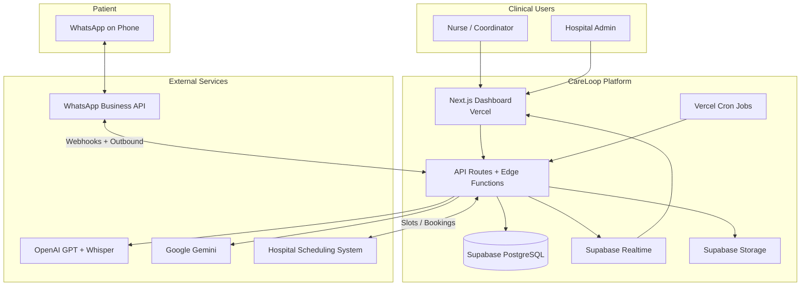
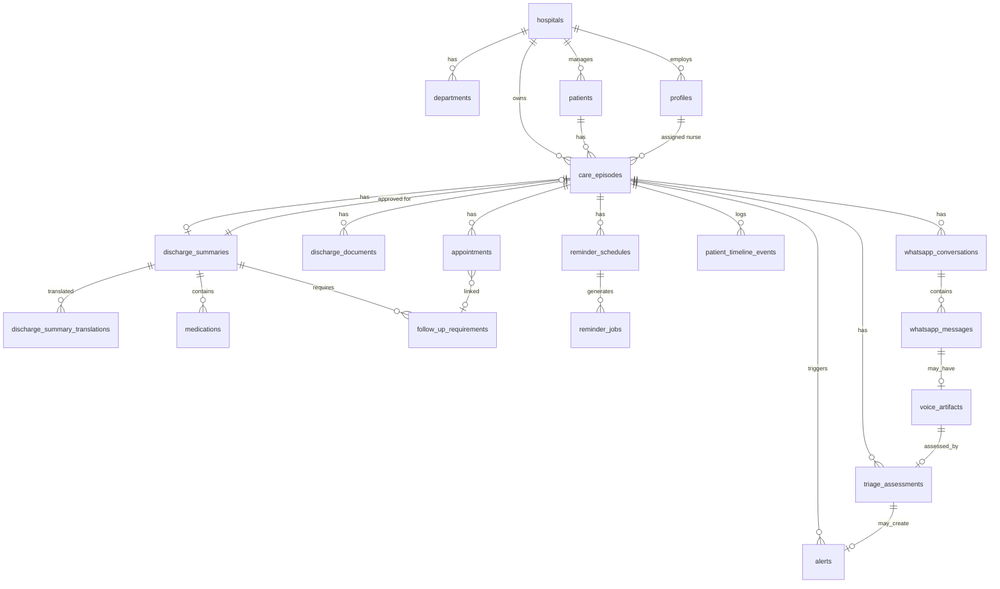
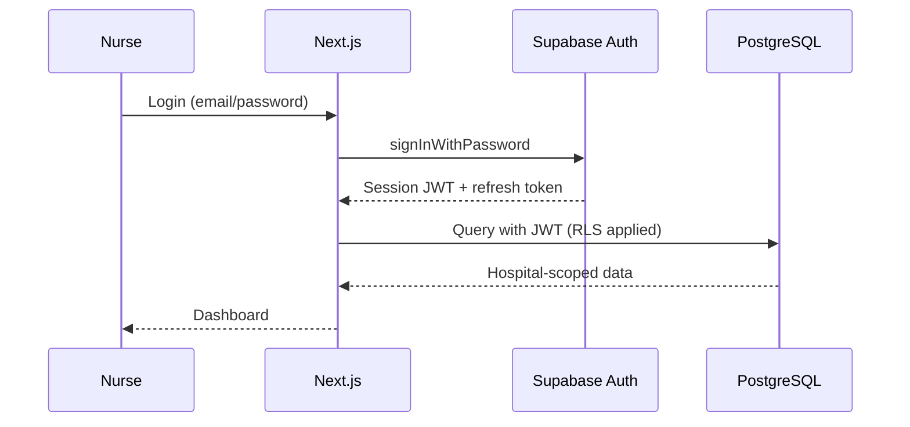
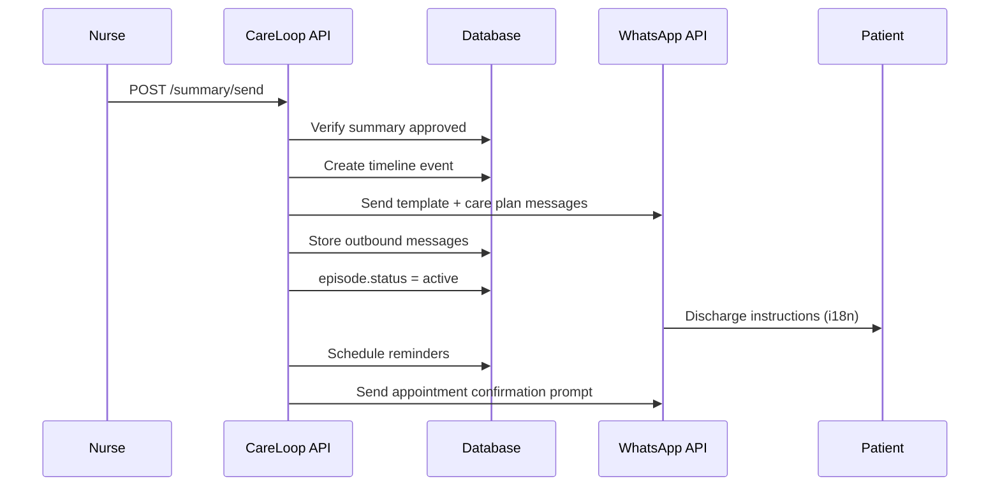
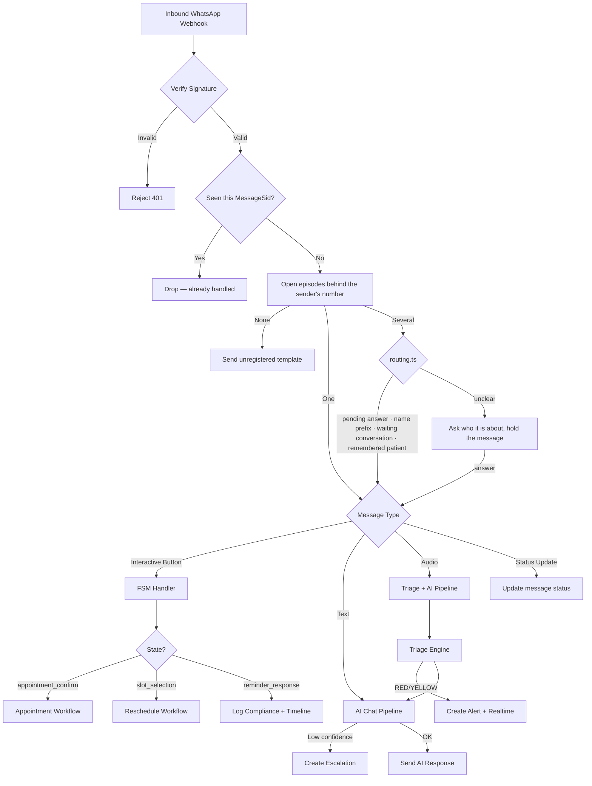
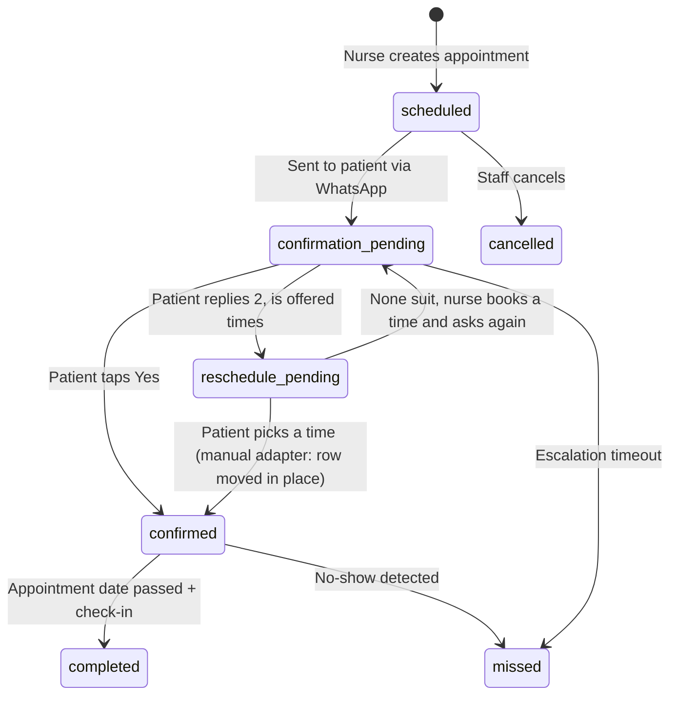
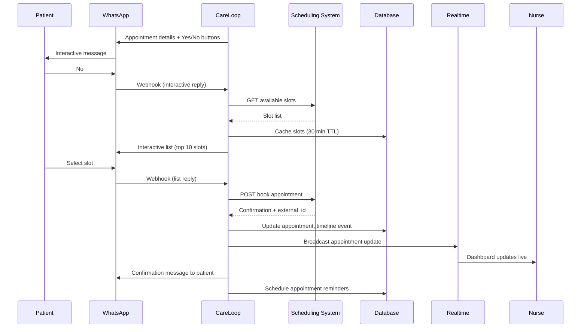
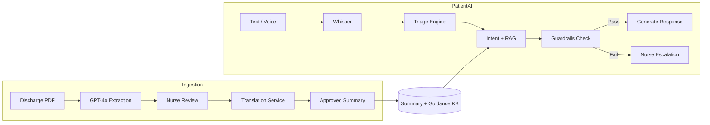
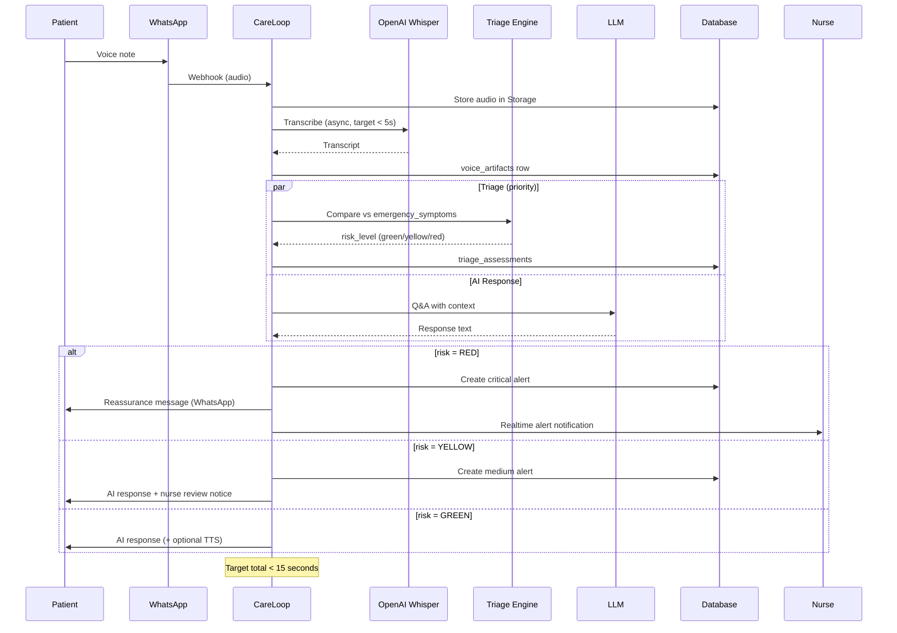
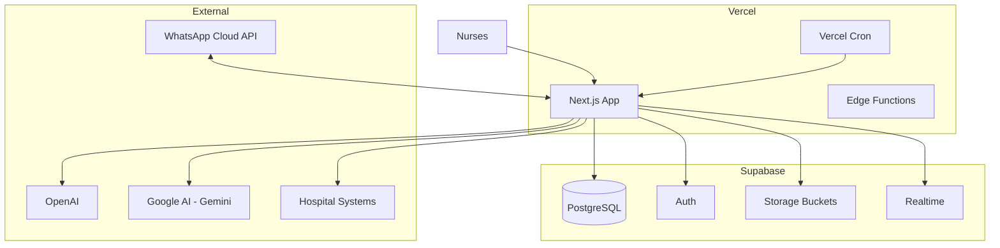

# CareLoop — System Architecture

> **Status:** Architecture proposal — pending approval before implementation.  
> **Source of truth:** [PROJECT_CONTEXT.md](./PROJECT_CONTEXT.md)

---

## Table of Contents

1. [Executive Summary](#1-executive-summary)
2. [Architecture Principles](#2-architecture-principles)
3. [High-Level System Context](#3-high-level-system-context)
4. [Multi-Hospital Support](#4-multi-hospital-support)
5. [Database Schema](#5-database-schema)
6. [Entity Relationships](#6-entity-relationships)
7. [User Roles & Permissions](#7-user-roles--permissions)
8. [Authentication Design](#8-authentication-design)
9. [API Endpoints](#9-api-endpoints)
10. [WhatsApp Workflow](#10-whatsapp-workflow)
11. [Appointment Workflow](#11-appointment-workflow)
12. [AI Workflow](#12-ai-workflow)
13. [Real-Time Architecture](#13-real-time-architecture)
14. [Folder Structure](#14-folder-structure)
15. [Deployment Architecture](#15-deployment-architecture)
16. [Security Architecture](#16-security-architecture)
17. [Scalability Considerations](#17-scalability-considerations)
18. [Implementation Phases](#18-implementation-phases)

---

## 1. Executive Summary

CareLoop is a **multi-tenant B2B healthcare platform** where clinical staff use a **Next.js dashboard** and patients interact exclusively via **WhatsApp**. The backend is **Supabase (PostgreSQL + Auth + Storage + Realtime)** with **Next.js API routes and Edge Functions** orchestrating AI services, WhatsApp webhooks, cron-driven reminders, and hospital scheduling integrations.

**Architectural split:**

| Surface | Technology | Users |
|---------|------------|-------|
| Clinical Dashboard | Next.js 15 (App Router) | Nurses, coordinators, admins |
| Patient Channel | WhatsApp Business API | Patients (no login) |
| Core Data | Supabase PostgreSQL + RLS | All tenants isolated |
| Async Jobs | Vercel Cron + Supabase Edge Functions | System |
| AI Pipeline | OpenAI GPT, Whisper, Google Gemini | System |
| Files | Supabase Storage | PDFs, audio, generated TTS |

---

## 2. Architecture Principles

1. **Tenant isolation first** — Every clinical record is scoped to a `hospital_id`. RLS enforces boundaries at the database layer.
2. **Patients are identity-light** — Patients are identified by verified WhatsApp phone number + active episode; no passwords or app accounts.
3. **Human-in-the-loop for clinical data** — AI extracts and suggests; nurses approve before patient delivery.
4. **Bounded AI** — AI answers only from approved discharge context; low confidence or out-of-scope queries escalate to nurses.
5. **Event-sourced patient timeline** — All WhatsApp interactions, reminders, triage results, and appointments append to an immutable timeline.
6. **Fail-safe triage** — Voice notes always run through triage; RED alerts are synchronous and sub-15-second.
7. **Audit everything** — PHI access, approvals, escalations, and AI decisions are logged.
8. **API-first internal design** — Dashboard and webhooks share the same service layer.

---

## 3. High-Level System Context



---

## 4. Multi-Hospital Support

### 4.1 Tenancy Model

CareLoop uses a **shared database, shared schema** model with **row-level tenant isolation** via `hospital_id` on every tenant-scoped table.

```
Organization (CareLoop SaaS)
└── Hospital (tenant)
    ├── Departments / Wards (optional)
    ├── Staff Users (nurses, coordinators, admins)
    ├── Patients (hospital MRN scoped)
    ├── Care Episodes (discharge journeys)
    └── Configuration (languages, WhatsApp number, scheduling adapter)
```

### 4.2 Tenant Configuration

Each hospital has isolated:

- WhatsApp Business phone number (or shared WABA with routing metadata)
- Branding (name, logo — future)
- Supported languages (subset of platform languages)
- Scheduling system credentials (adapter pattern)
- AI escalation rules and approved guidance library
- Timezone (default: `Asia/Dubai`)

### 4.3 Cross-Tenant Rules

- Staff users belong to **one hospital** by default; platform super-admins may access all hospitals.
- Patients may exist at multiple hospitals over time but each **care episode** belongs to exactly one hospital.
- Phone number uniqueness is scoped: `(hospital_id, phone_e164)` for active episodes; historical episodes remain linked.

### 4.4 Data Residency (UAE)

- Primary Supabase project region: **Middle East / EU** (nearest available to UAE at deployment time).
- PHI must not leave approved regions; AI provider calls use **data processing agreements** and minimal payload (no unnecessary identifiers in prompts).

---

## 5. Database Schema

### 5.1 Conventions

- Primary keys: `uuid` (`gen_random_uuid()`)
- Timestamps: `created_at`, `updated_at` (auto-managed)
- Soft delete: `deleted_at` where applicable
- Enums stored as PostgreSQL `ENUM` or `text` with check constraints
- All tenant tables include `hospital_id uuid NOT NULL REFERENCES hospitals(id)`

### 5.2 Core Tables

#### `hospitals`
| Column | Type | Notes |
|--------|------|-------|
| id | uuid PK | |
| name | text | |
| slug | text UNIQUE | URL-safe identifier |
| timezone | text | Default `Asia/Dubai` |
| whatsapp_phone_number_id | text | Meta phone number ID |
| scheduling_adapter | text | `manual`, `epic`, `cerner`, `custom` |
| scheduling_config | jsonb | Encrypted credentials reference |
| settings | jsonb | Languages, escalation thresholds |
| is_active | boolean | |
| created_at | timestamptz | |

#### `departments` (optional grouping)
| Column | Type | Notes |
|--------|------|-------|
| id | uuid PK | |
| hospital_id | uuid FK | |
| name | text | e.g. Cardiology, General Ward |
| created_at | timestamptz | |

#### `profiles` (extends Supabase Auth users)
| Column | Type | Notes |
|--------|------|-------|
| id | uuid PK | = `auth.users.id` |
| hospital_id | uuid FK | |
| department_id | uuid FK NULL | |
| full_name | text | |
| role | user_role ENUM | See §7 |
| phone | text NULL | |
| avatar_url | text NULL | |
| is_active | boolean | |
| created_at | timestamptz | |

#### `patients`
| Column | Type | Notes |
|--------|------|-------|
| id | uuid PK | |
| hospital_id | uuid FK | |
| mrn | text | Hospital medical record number |
| full_name | text | |
| phone_e164 | text | WhatsApp number |
| preferred_language | language_code ENUM | ar, en, hi, ta, tl |
| date_of_birth | date NULL | |
| assigned_nurse_id | uuid FK → profiles NULL | |
| metadata | jsonb | Non-clinical tags |
| created_at | timestamptz | |

**Unique:** `(hospital_id, mrn)`, index on `(hospital_id, phone_e164)`

#### `care_episodes`
A single post-discharge journey from upload to closure.

| Column | Type | Notes |
|--------|------|-------|
| id | uuid PK | |
| hospital_id | uuid FK | |
| patient_id | uuid FK | |
| status | episode_status ENUM | `draft`, `pending_review`, `active`, `completed`, `cancelled` |
| discharge_date | date | |
| assigned_nurse_id | uuid FK → profiles | |
| current_risk_level | risk_level ENUM | `green`, `yellow`, `red` |
| compliance_score | numeric(5,2) NULL | Computed periodically |
| started_at | timestamptz NULL | When sent to patient |
| ended_at | timestamptz NULL | |
| created_at | timestamptz | |

#### `discharge_documents`
| Column | Type | Notes |
|--------|------|-------|
| id | uuid PK | |
| episode_id | uuid FK | |
| hospital_id | uuid FK | |
| storage_path | text | Supabase Storage path |
| original_filename | text | |
| uploaded_by | uuid FK → profiles | |
| extraction_status | text | `pending`, `processing`, `completed`, `failed` |
| raw_extraction | jsonb NULL | AI raw output |
| created_at | timestamptz | |

#### `discharge_summaries` (nurse-approved canonical record)
| Column | Type | Notes |
|--------|------|-------|
| id | uuid PK | |
| episode_id | uuid FK UNIQUE | One approved summary per episode |
| hospital_id | uuid FK | |
| version | int | Increments on re-approval |
| status | summary_status ENUM | `draft`, `pending_review`, `approved`, `sent` |
| source_language | language_code | Language of original PDF |
| approved_by | uuid FK → profiles NULL | |
| approved_at | timestamptz NULL | |
| nurse_notes | text NULL | |
| emergency_symptoms | jsonb | Array of symptom strings |
| lifestyle_instructions | jsonb | |
| restrictions | jsonb | |
| activities | jsonb | |
| created_at | timestamptz | |

#### `discharge_summary_translations`
| Column | Type | Notes |
|--------|------|-------|
| id | uuid PK | |
| summary_id | uuid FK | |
| language | language_code | |
| content | jsonb | Structured translated fields + `source_hash` of the text they were made from (used only while it matches the saved summary) |
| created_at | timestamptz | |

**Unique:** `(summary_id, language)`

#### `medications`
| Column | Type | Notes |
|--------|------|-------|
| id | uuid PK | |
| summary_id | uuid FK | |
| hospital_id | uuid FK | |
| name | text | |
| dosage | text | |
| frequency | text | |
| instructions | text | |
| reminder_times | time[] | e.g. `{08:00, 20:00}` |
| sort_order | int | |
| created_at | timestamptz | |

#### `follow_up_requirements`
| Column | Type | Notes |
|--------|------|-------|
| id | uuid PK | |
| summary_id | uuid FK | |
| hospital_id | uuid FK | |
| specialty | text | |
| deadline | date NULL | |
| instructions | text NULL | |
| created_at | timestamptz | |

#### `appointments`
| Column | Type | Notes |
|--------|------|-------|
| id | uuid PK | |
| episode_id | uuid FK | |
| hospital_id | uuid FK | |
| follow_up_id | uuid FK NULL | |
| external_id | text NULL | HIS reference |
| specialty | text | |
| scheduled_at | timestamptz | |
| location | text NULL | |
| status | appointment_status ENUM | See §11 |
| confirmation_requested_at | timestamptz NULL | |
| confirmed_at | timestamptz NULL | |
| rescheduled_from_id | uuid FK → appointments NULL | |
| created_at | timestamptz | |

#### `appointment_slots_cache`
Temporary cache of available slots from HIS for rescheduling UI via WhatsApp.

| Column | Type | Notes |
|--------|------|-------|
| id | uuid PK | |
| hospital_id | uuid FK | |
| episode_id | uuid FK | |
| slots | jsonb | Array of `{id, datetime, specialty}` |
| expires_at | timestamptz | Short TTL (e.g. 30 min) |
| created_at | timestamptz | |

#### `reminder_schedules`
| Column | Type | Notes |
|--------|------|-------|
| id | uuid PK | |
| episode_id | uuid FK | |
| hospital_id | uuid FK | |
| type | reminder_type ENUM | `medication`, `exercise`, `hydration`, `symptom_check`, `appointment` |
| scheduled_time | time | Local hospital timezone |
| medication_id | uuid FK NULL | |
| message_template_key | text | i18n key |
| is_active | boolean | |
| created_at | timestamptz | |

#### `reminder_jobs`
Materialized upcoming sends (cron picks these up).

| Column | Type | Notes |
|--------|------|-------|
| id | uuid PK | |
| schedule_id | uuid FK | |
| episode_id | uuid FK | |
| hospital_id | uuid FK | |
| fire_at | timestamptz | UTC |
| status | job_status ENUM | `pending`, `sent`, `failed`, `cancelled` |
| whatsapp_message_id | text NULL | |
| created_at | timestamptz | |

#### `patient_timeline_events`
Immutable audit log of all patient interactions.

| Column | Type | Notes |
|--------|------|-------|
| id | uuid PK | |
| episode_id | uuid FK | |
| hospital_id | uuid FK | |
| event_type | timeline_event_type ENUM | See below |
| payload | jsonb | Event-specific data |
| risk_level | risk_level NULL | |
| created_by | uuid NULL | Staff or NULL (system/patient) |
| created_at | timestamptz | |

**`timeline_event_type`:** `discharge_uploaded`, `extraction_completed`, `summary_approved`, `summary_sent`, `whatsapp_inbound`, `whatsapp_outbound`, `reminder_sent`, `reminder_response`, `appointment_confirmed`, `appointment_rescheduled`, `triage_completed`, `ai_response`, `escalation_created`, `alert_acknowledged`

#### `whatsapp_conversations`
| Column | Type | Notes |
|--------|------|-------|
| id | uuid PK | |
| episode_id | uuid FK | |
| hospital_id | uuid FK | |
| patient_id | uuid FK | |
| wa_phone | text | |
| last_message_at | timestamptz | |
| conversation_state | jsonb | FSM state for multi-step flows |
| created_at | timestamptz | |

#### `whatsapp_number_sessions`
| Column | Type | Notes |
|--------|------|-------|
| hospital_id | uuid FK | PK part |
| wa_phone | text | PK part — the sender's number |
| active_patient_id | uuid FK NULL | the patient this number's messages are currently about |
| active_until | timestamptz NULL | that memory lapses after 24 h |
| pending_choice | jsonb NULL | `{ options: [patient ids as listed], held: message to replay, askedAt, repeated }` |
| created_at / updated_at | timestamptz | |

One row per sender number that is linked to more than one open episode (a shared family phone, a
relative writing for two patients). Written only by the webhook handler; staff read it on the
episode page. A number with a single open episode never gets a row.

#### `whatsapp_messages`
| Column | Type | Notes |
|--------|------|-------|
| id | uuid PK | |
| conversation_id | uuid FK | |
| hospital_id | uuid FK | |
| direction | text | `inbound`, `outbound` |
| message_type | text | `text`, `interactive`, `audio`, `template` |
| wa_message_id | text UNIQUE NULL | |
| content | text NULL | |
| media_storage_path | text NULL | |
| metadata | jsonb | Buttons, templates, etc. |
| status | text | `sent`, `delivered`, `read`, `failed` |
| created_at | timestamptz | |

#### `voice_artifacts`
| Column | Type | Notes |
|--------|------|-------|
| id | uuid PK | |
| episode_id | uuid FK | |
| hospital_id | uuid FK | |
| message_id | uuid FK → whatsapp_messages | |
| audio_storage_path | text | |
| transcript | text NULL | |
| transcript_language | language_code NULL | |
| duration_seconds | int NULL | |
| created_at | timestamptz | |

#### `triage_assessments`
| Column | Type | Notes |
|--------|------|-------|
| id | uuid PK | |
| episode_id | uuid FK | |
| hospital_id | uuid FK | |
| voice_artifact_id | uuid FK NULL | |
| inbound_text | text NULL | For text-triggered triage |
| risk_level | risk_level | |
| matched_symptoms | jsonb | |
| reasoning | text NULL | Internal only |
| processing_ms | int | |
| model_version | text | |
| created_at | timestamptz | |

#### `alerts`
| Column | Type | Notes |
|--------|------|-------|
| id | uuid PK | |
| episode_id | uuid FK | |
| hospital_id | uuid FK | |
| triage_id | uuid FK NULL | |
| type | alert_type ENUM | `risk_red`, `risk_yellow`, `escalation`, `missed_appointment`, `unconfirmed_appointment` |
| severity | text | `low`, `medium`, `high`, `critical` |
| status | alert_status ENUM | `open`, `acknowledged`, `resolved` |
| assigned_to | uuid FK → profiles NULL | |
| acknowledged_by | uuid FK NULL | |
| acknowledged_at | timestamptz NULL | |
| resolved_at | timestamptz NULL | |
| created_at | timestamptz | |

#### `ai_interactions`
| Column | Type | Notes |
|--------|------|-------|
| id | uuid PK | |
| episode_id | uuid FK | |
| hospital_id | uuid FK | |
| input_type | text | `text`, `voice` |
| input_text | text | |
| output_text | text NULL | |
| confidence | numeric(3,2) NULL | |
| escalated | boolean | |
| model | text | `gpt-4o`, `gemini-1.5-pro`, etc. |
| context_tokens | int NULL | |
| created_at | timestamptz | |

#### `escalations`
| Column | Type | Notes |
|--------|------|-------|
| id | uuid PK | |
| episode_id | uuid FK | |
| hospital_id | uuid FK | |
| ai_interaction_id | uuid FK NULL | |
| reason | text | |
| status | text | `open`, `in_progress`, `closed` |
| assigned_to | uuid FK → profiles | |
| created_at | timestamptz | |

#### `compliance_snapshots`
Daily rollup for dashboard trends.

| Column | Type | Notes |
|--------|------|-------|
| id | uuid PK | |
| episode_id | uuid FK | |
| hospital_id | uuid FK | |
| snapshot_date | date | |
| medication_adherence | numeric(5,2) | |
| reminder_response_rate | numeric(5,2) | |
| symptom_checks_completed | int | |
| created_at | timestamptz | |

**Unique:** `(episode_id, snapshot_date)`

#### `analytics_daily`
Hospital-level aggregates (materialized by nightly job).

| Column | Type | Notes |
|--------|------|-------|
| id | uuid PK | |
| hospital_id | uuid FK | |
| metric_date | date | |
| active_patients | int | |
| alerts_triggered | int | |
| appointments_completed | int | |
| appointments_missed | int | |
| avg_medication_adherence | numeric(5,2) | |
| avg_response_rate | numeric(5,2) | |
| readmissions_prevented | int NULL | Manual/imported initially |
| estimated_savings_aed | numeric NULL | |
| created_at | timestamptz | |

#### `audit_logs`
| Column | Type | Notes |
|--------|------|-------|
| id | uuid PK | |
| hospital_id | uuid FK NULL | |
| actor_id | uuid NULL | |
| action | text | |
| resource_type | text | |
| resource_id | uuid NULL | |
| ip_address | inet NULL | |
| metadata | jsonb | |
| created_at | timestamptz | |

#### `hospital_approved_guidance`
Curated Q&A snippets the AI may cite beyond discharge summary.

| Column | Type | Notes |
|--------|------|-------|
| id | uuid PK | |
| hospital_id | uuid FK | |
| category | text | |
| question_patterns | jsonb | |
| answer | jsonb | Per-language |
| is_active | boolean | |
| created_at | timestamptz | |

### 5.3 ENUM Definitions

```sql
CREATE TYPE user_role AS ENUM (
  'super_admin',      -- CareLoop platform
  'hospital_admin',
  'discharge_coordinator',
  'nurse',
  'case_manager',
  'read_only'         -- Analytics / leadership view
);

CREATE TYPE language_code AS ENUM ('ar', 'en', 'hi', 'ta', 'tl');

CREATE TYPE episode_status AS ENUM ('draft', 'pending_review', 'active', 'completed', 'cancelled');

CREATE TYPE summary_status AS ENUM ('draft', 'pending_review', 'approved', 'sent');

CREATE TYPE risk_level AS ENUM ('green', 'yellow', 'red');

CREATE TYPE appointment_status AS ENUM (
  'scheduled',
  'confirmation_pending',
  'confirmed',
  'reschedule_pending',
  'rescheduled',
  'missed',
  'completed',
  'cancelled'
);

CREATE TYPE reminder_type AS ENUM ('medication', 'exercise', 'hydration', 'symptom_check', 'appointment');

CREATE TYPE job_status AS ENUM ('pending', 'sent', 'failed', 'cancelled');

CREATE TYPE alert_type AS ENUM ('risk_red', 'risk_yellow', 'escalation', 'missed_appointment', 'unconfirmed_appointment');

CREATE TYPE alert_status AS ENUM ('open', 'acknowledged', 'resolved');
```

### 5.4 Indexes (Key)

| Table | Index | Purpose |
|-------|-------|---------|
| care_episodes | `(hospital_id, status)` | Active patient lists |
| care_episodes | `(assigned_nurse_id, status)` | Nurse workload |
| patients | `(hospital_id, phone_e164)` | WhatsApp lookup |
| reminder_jobs | `(fire_at, status)` WHERE status = `pending` | Cron dispatcher |
| alerts | `(hospital_id, status, created_at DESC)` | Dashboard alerts |
| patient_timeline_events | `(episode_id, created_at DESC)` | Profile timeline |
| appointments | `(episode_id, scheduled_at)` | Appointment views |

---

## 6. Entity Relationships



**Cardinality notes:**

- One **active** care episode per patient per hospital at a time (enforced by partial unique index).
- One approved `discharge_summaries` row per episode; versions tracked via `version` column.
- `appointments.rescheduled_from_id` forms a linked list for reschedule history.

---

## 7. User Roles & Permissions

### 7.1 Role Matrix

| Permission | super_admin | hospital_admin | discharge_coordinator | nurse | case_manager | read_only |
|------------|:-----------:|:--------------:|:---------------------:|:-----:|:------------:|:---------:|
| Manage hospital settings | ✓ (all) | ✓ (own) | — | — | — | — |
| Manage staff users | ✓ | ✓ | — | — | — | — |
| View all hospital patients | ✓ | ✓ | ✓ | — | ✓ | ✓ |
| View assigned patients only | — | — | — | ✓ | — | — |
| Upload discharge PDF | ✓ | ✓ | ✓ | ✓ | — | — |
| Edit / approve discharge summary | ✓ | ✓ | ✓ | ✓ | — | — |
| Send summary to patient | ✓ | ✓ | ✓ | ✓ | — | — |
| View patient timeline | ✓ | ✓ | ✓ | ✓ (assigned) | ✓ | ✓ |
| Acknowledge / resolve alerts | ✓ | ✓ | ✓ | ✓ (assigned) | ✓ | — |
| Manage escalations | ✓ | ✓ | ✓ | ✓ (assigned) | ✓ | — |
| View analytics | ✓ | ✓ | ✓ | — | ✓ | ✓ |
| Export data | ✓ | ✓ | — | — | — | — |
| Access audit logs | ✓ | ✓ | — | — | — | — |

### 7.2 Row Level Security (RLS) Policies

RLS is **enabled on all tenant tables**. Service role bypasses RLS only in trusted server contexts (webhooks, cron).

**Policy patterns:**

```text
super_admin     → auth.jwt() ->> 'role' = 'super_admin'
hospital scope  → hospital_id = (SELECT hospital_id FROM profiles WHERE id = auth.uid())
nurse scope     → above AND (assigned_nurse_id = auth.uid() OR role IN coordinator roles)
patient data    → no direct patient auth; WhatsApp handlers use service role
```

**Example policy (care_episodes SELECT for nurses):**

```sql
-- Coordinators/admins: all episodes in hospital
-- Nurses: only episodes where assigned_nurse_id = auth.uid()
```

### 7.3 API Authorization

- Dashboard requests: Supabase session JWT + server-side role check.
- Webhooks (WhatsApp): HMAC signature verification, no user JWT.
- Cron: `CRON_SECRET` header validation.
- Internal service role: never exposed to client.

---

## 8. Authentication Design

### 8.1 Clinical Users (Dashboard)

| Aspect | Design |
|--------|--------|
| Provider | Supabase Auth |
| Methods | Email + password (v1); SSO/SAML (future enterprise) |
| Session | HTTP-only cookies via `@supabase/ssr` in Next.js |
| MFA | TOTP enforced for `hospital_admin` and `super_admin` (phase 2) |
| Invitation flow | Admin invites → magic link or temp password → profile created with `hospital_id` + `role` |
| JWT claims | `role`, `hospital_id` synced to `app_metadata` on login |

### 8.2 Patients (WhatsApp)

Patients **do not authenticate** to CareLoop.

**Identity resolution on inbound WhatsApp message** (`lib/whatsapp/recipient.ts`, `routing.ts`):

1. Verify webhook signature (Twilio HMAC).
2. Drop a redelivered message: the MessageSid is `whatsapp_messages.wa_message_id` (UNIQUE), and
   the inbound insert is the atomic claim — a retry or double-tap is handled once.
3. Extract `from` (E.164); hospital from the `To` number (`hospitals.whatsapp_phone_number_id`).
4. Every open episode (`active` or `pending_review`) whose patient has that `phone_e164` at that
   hospital is a candidate. A number is **not unique to one patient**: a family shares a phone, a
   daughter writes for both parents, a tester registers several demo patients on their own number.
5. No candidate → "not registered" (or "no active episode" for a known number). No row is written.
6. One candidate → that patient, exactly as before.
7. Several → `routeInbound()` picks the conversation, first match wins: a pending "who is this
   about?" answer · a patient's name at the start of the message · `switch` · the remembered patient
   when a question is waiting on their conversation · the only conversation waiting for a reply ·
   the patient written about in the last 24 h · an emergency keyword (best guess, never held) ·
   otherwise the sender is asked and the message is held until they answer, then replayed.
8. Each patient keeps their own `whatsapp_conversations` row, FSM state and transcript. The routing
   reason is stored on the inbound row (`metadata.routing.via`) and shown on the dashboard.

Messages from one sender are processed in order, one at a time (`sender-queue.ts`, per process);
different senders are independent — the one hospital number serves everyone concurrently.

### 8.3 Service Accounts

| Account | Purpose |
|---------|---------|
| `service_role` | Webhooks, cron, AI pipeline (server-only) |
| `anon` | Not used for PHI reads; dashboard uses authenticated session |

### 8.4 Auth Flow Diagram



---

## 9. API Endpoints

All dashboard endpoints are under `/api/v1/`. Responses use `{ data, error, meta }` envelope. Errors follow RFC 7807-style problem details.

### 9.1 Auth & Users

| Method | Endpoint | Description | Roles |
|--------|----------|-------------|-------|
| POST | `/api/v1/auth/callback` | Supabase OAuth/callback handler | Public |
| GET | `/api/v1/me` | Current user profile | Authenticated |
| PATCH | `/api/v1/me` | Update own profile | Authenticated |
| GET | `/api/v1/users` | List hospital staff | admin, coordinator |
| POST | `/api/v1/users/invite` | Invite staff member | admin |
| PATCH | `/api/v1/users/:id` | Update role/status | admin |
| DELETE | `/api/v1/users/:id` | Deactivate user | admin |

### 9.2 Hospitals & Settings

| Method | Endpoint | Description | Roles |
|--------|----------|-------------|-------|
| GET | `/api/v1/hospital` | Current hospital config | admin, coordinator |
| PATCH | `/api/v1/hospital` | Update settings | admin |
| GET | `/api/v1/hospital/guidance` | Approved AI guidance library | admin, coordinator |
| POST | `/api/v1/hospital/guidance` | Add guidance entry | admin |

### 9.3 Patients & Episodes

| Method | Endpoint | Description | Roles |
|--------|----------|-------------|-------|
| GET | `/api/v1/patients` | Paginated patient list | clinical+ |
| POST | `/api/v1/patients` | Register patient | coordinator, nurse |
| GET | `/api/v1/patients/:id` | Patient detail | clinical+ |
| PATCH | `/api/v1/patients/:id` | Update patient info | coordinator, nurse |
| GET | `/api/v1/episodes` | List episodes (filters) | clinical+ |
| POST | `/api/v1/episodes` | Create care episode | coordinator, nurse |
| GET | `/api/v1/episodes/:id` | Episode detail + summary | clinical+ |
| PATCH | `/api/v1/episodes/:id` | Update assignment/status | coordinator, nurse |

### 9.4 Clinical Ingestion

| Method | Endpoint | Description | Roles |
|--------|----------|-------------|-------|
| POST | `/api/v1/episodes/:id/documents` | Upload discharge PDF | coordinator, nurse |
| GET | `/api/v1/episodes/:id/documents/:docId` | Document metadata | clinical+ |
| POST | `/api/v1/episodes/:id/extract` | Trigger AI extraction | coordinator, nurse |
| GET | `/api/v1/episodes/:id/summary` | Get draft/approved summary | clinical+ |
| PATCH | `/api/v1/episodes/:id/summary` | Edit extracted fields | coordinator, nurse |
| POST | `/api/v1/episodes/:id/summary/approve` | Approve summary | coordinator, nurse |
| POST | `/api/v1/episodes/:id/summary/send` | Send to patient via WhatsApp | coordinator, nurse |

### 9.5 Timeline & Communications

| Method | Endpoint | Description | Roles |
|--------|----------|-------------|-------|
| GET | `/api/v1/episodes/:id/timeline` | Patient timeline events | clinical+ |
| GET | `/api/v1/episodes/:id/messages` | WhatsApp message history | clinical+ |
| POST | `/api/v1/episodes/:id/messages` | Nurse writes to the patient, translated into their language unless `translate: false` (conversation → `nurse_attending`) | clinical+ |
| POST | `/api/v1/episodes/:id/messages/translate` | `{ ids }` → English for those messages ("Show English"), kept in `metadata.translation_en` | any role that can see the episode |
| PATCH | `/api/v1/episodes/:id/messages` | `{ attending: false }` hands the conversation back to the assistant | clinical+ |
| DELETE | `/api/v1/episodes/:id/number-session` | Forget who the patient's (shared) number is currently writing about | clinical+ |
| POST | `/api/v1/episodes/:id/risk` | `{ level, from, note }` — a nurse sets the patient's colour; a note is required to lower it; timeline `risk_changed` + `audit_logs` | clinical+ |
| GET | `/api/v1/intake/number-in-use?phone=` | Other patients with an open episode on a WhatsApp number (intake hint) | intake roles |
| GET | `/api/v1/episodes/:id/voice-artifacts` | Voice notes + transcripts | clinical+ |

### 9.6 Appointments

| Method | Endpoint | Description | Roles |
|--------|----------|-------------|-------|
| GET | `/api/v1/episodes/:id/appointments` | List appointments | clinical+ |
| POST | `/api/v1/episodes/:id/appointments` | Create appointment | coordinator, nurse |
| PATCH | `/api/v1/appointments/:id` | Update appointment | coordinator, nurse |
| POST | `/api/v1/appointments/:id/escalate` | Escalate unconfirmed | coordinator, nurse |
| GET | `/api/v1/appointments/:id/slots` | Fetch available slots (HIS) | coordinator, nurse |

### 9.7 Alerts & Escalations

| Method | Endpoint | Description | Roles |
|--------|----------|-------------|-------|
| GET | `/api/v1/alerts` | Hospital alert feed | clinical+ |
| PATCH | `/api/v1/alerts/:id/acknowledge` | Acknowledge alert | clinical+ |
| PATCH | `/api/v1/alerts/:id/resolve` | Resolve alert | clinical+ |
| GET | `/api/v1/escalations` | Open escalations | clinical+ |
| PATCH | `/api/v1/escalations/:id` | Update escalation | clinical+ |

### 9.8 Analytics

| Method | Endpoint | Description | Roles |
|--------|----------|-------------|-------|
| GET | `/api/v1/analytics/overview` | Dashboard KPIs | admin, coordinator, read_only |
| GET | `/api/v1/analytics/compliance` | Compliance trends | admin, coordinator, read_only |
| GET | `/api/v1/analytics/appointments` | Appointment metrics | admin, coordinator, read_only |

### 9.9 Webhooks (No JWT — Signature Auth)

| Method | Endpoint | Description |
|--------|----------|-------------|
| GET | `/api/webhooks/whatsapp` | Meta webhook verification |
| POST | `/api/webhooks/whatsapp` | Inbound messages + status updates |
| POST | `/api/webhooks/scheduling` | HIS callback (optional) |

### 9.10 Cron (CRON_SECRET Header)

| Method | Endpoint | Description |
|--------|----------|-------------|
| POST | `/api/cron/reminders/dispatch` | Send due reminder jobs |
| POST | `/api/cron/reminders/generate` | Generate next 24h reminder jobs |
| POST | `/api/cron/appointments/escalate` | Escalate unconfirmed appointments |
| POST | `/api/cron/appointments/missed` | Mark missed appointments |
| POST | `/api/cron/analytics/rollup` | Nightly analytics aggregation |
| POST | `/api/cron/compliance/snapshot` | Daily compliance snapshots |

### 9.11 Internal AI (Server-Only)

| Method | Endpoint | Description |
|--------|----------|-------------|
| POST | `/api/internal/ai/extract` | PDF → structured discharge |
| POST | `/api/internal/ai/translate` | Translate summary fields |
| POST | `/api/internal/ai/chat` | Patient Q&A with guardrails |
| POST | `/api/internal/ai/triage` | Symptom risk classification |
| POST | `/api/internal/ai/transcribe` | Whisper transcription |
| POST | `/api/internal/ai/tts` | Optional voice response generation |

---

## 10. WhatsApp Workflow

### 10.1 Message Types Used

| Type | Use Case |
|------|----------|
| Template messages | Initial opt-in, discharge summary delivery (Meta-approved templates) |
| Interactive buttons | Yes/No, appointment confirmation, menu navigation |
| Interactive lists | Appointment slot selection |
| Text | AI responses, reminders, the who-is-this-about question on a shared number |
| Audio | Inbound voice notes; outbound TTS care plan playback |
| Image / document (inbound) | Not read: the patient is told so and asked to describe it or send a voice note |
| Delivery receipts | Twilio `StatusCallback` to the same webhook: sent → delivered → read, or failed with the reason |

### 10.2 Outbound Flow — Discharge Delivery



### 10.3 Inbound Flow — Message Router



### 10.4 Conversation State Machine

Stored in `whatsapp_conversations.conversation_state`:

| State | Trigger | Next |
|-------|---------|------|
| `idle` | Default | — |
| `awaiting_appointment_confirm` | After appointment details sent | `1` → confirmed; `2` → offer the next clinic days |
| `awaiting_slot_selection` | Patient asked to change it | number or matching date → appointment moved, confirmed; none / another date → nurse alert; other text → assistant, times stay on offer |
| `awaiting_reminder_response` | After reminder sent | Parse yes/no/text/voice |
| `awaiting_checkin_meds` | Nightly check-in Q1 sent | 1/2/3 → log, ask Q2; free text → triage |
| `awaiting_checkin_symptoms` | Nightly check-in Q2 sent | OK → good night; symptoms → triage |
| `nurse_attending` | A nurse wrote from the dashboard | replies logged only, 30 min or hand-back |

A conversation in any `awaiting_*` or `nurse_attending` state counts as *waiting* for shared-number
routing: an unaddressed reply from a number linked to several patients goes to the one conversation
that is waiting.

### 10.5 WhatsApp Compliance

- 24-hour session window: use templates to re-open conversation when expired.
- Opt-in captured during in-hospital registration (documented consent).
- All templates pre-approved in Meta Business Manager per hospital.

---

## 11. Appointment Workflow

### 11.1 State Machine



### 11.2 Confirmation Flow (WhatsApp)



### 11.3 Escalation Rules

| Condition | Action |
|-----------|--------|
| No response in 24h | Send reminder template |
| No response in 48h | Create `unconfirmed_appointment` alert |
| No response in 72h | Assign to coordinator; notify via dashboard |

### 11.4 Scheduling Adapter Interface

```typescript
// Conceptual interface — not implementation code
interface SchedulingAdapter {
  getAvailableSlots(params: { specialty, from, to, patientExternalId? }): Promise<Slot[]>
  bookAppointment(params: { slotId, patient, episode }): Promise<BookingResult>
  cancelAppointment(params: { externalId }): Promise<void>
}
```

Adapters: `manual` (staff enters slots), `custom` (REST), future `epic` / `cerner`.

---

## 12. AI Workflow

### 12.1 Pipeline Overview



### 12.2 Clinical Ingestion (PDF Extraction)

1. Upload PDF → Supabase Storage.
2. Extract text (pdf-parse or Vision API for scanned docs).
3. **GPT-4o** structured extraction → JSON schema matching `medications`, `follow_up_requirements`, `emergency_symptoms`, etc.
4. Store `raw_extraction` + populate draft `discharge_summaries`.
5. **Translation:** parallel calls per target language (patient preferred + hospital defaults).
6. Nurse edits → approve → triggers send workflow.

**Model choice:** GPT-4o for structured extraction (high accuracy on medical entities).

### 12.3 Patient Q&A (Text)

1. Embed patient question.
2. Retrieve context: approved summary (patient language), medications, appointments, `hospital_approved_guidance`.
3. **Gemini** or **GPT-4o** generates response with system prompt guardrails.
4. **Confidence scoring:** if < 0.75 or forbidden intent detected → escalation.
5. Log to `ai_interactions` + `patient_timeline_events`.
6. Respond in `preferred_language`.

**Forbidden intents (auto-escalate):** diagnosis requests, new medication, dosage changes, emergency symptoms.

### 12.4 Voice Pipeline



### 12.5 Triage Engine Design

**Input:** transcript + `discharge_summaries.emergency_symptoms` + recent timeline context.

**Processing:**
1. Keyword + semantic similarity match against patient-specific emergency symptoms.
2. **Gemini** classification with few-shot examples (faster reasoning for safety-critical path).
3. Output: `risk_level`, `matched_symptoms`, `reasoning` (internal).

**SLA:** Parallel transcription + triage; timeout at 12s → default YELLOW + alert.

### 12.6 AI Guardrails (System Prompt Principles)

- Answer only from provided context blocks.
- Never diagnose, prescribe, or modify treatment.
- Detect emergency language → short-circuit to triage RED.
- Respond in patient's preferred language.
- Cite "contact your care team" for uncertainty.

### 12.7 Model Allocation

| Task | Primary Model | Fallback |
|------|---------------|----------|
| PDF extraction | GPT-4o | Gemini 1.5 Pro |
| Translation | GPT-4o-mini | Gemini 1.5 Flash |
| Patient Q&A | Gemini 1.5 Pro | GPT-4o |
| Triage classification | Gemini 1.5 Pro | GPT-4o |
| Transcription | Whisper | — |
| TTS (optional) | OpenAI TTS | — |

---

## 13. Real-Time Architecture

### 13.1 Supabase Realtime Channels

| Channel | Pattern | Subscribers | Events |
|---------|---------|-------------|--------|
| `hospital:{id}:alerts` | Postgres Changes | All clinical staff dashboard | INSERT on `alerts` |
| `hospital:{id}:episodes` | Postgres Changes | Patient list view | UPDATE on `care_episodes` |
| `episode:{id}:timeline` | Postgres Changes | Patient profile page | INSERT on `patient_timeline_events` |
| `episode:{id}:appointment` | Broadcast | Patient profile | Appointment status changes |
| `nurse:{id}:assignments` | Postgres Changes | Nurse home view | Episodes assigned to nurse |
| `transcript-{conversationId}` | Postgres Changes | Conversation tab | INSERT + UPDATE on `whatsapp_messages` (new messages, delivery receipts, English translations) |
| `number-session-{phone}` | Postgres Changes | Conversation tab (shared number) | `whatsapp_number_sessions` — who the number is writing about, pending question |

### 13.2 Dashboard Integration

```text
Client (Next.js)
  → supabase.channel('hospital:xxx:alerts')
  → on INSERT → toast notification + alert badge increment
  → React Query invalidation for affected queries
```

### 13.3 Alert Priority UX

| Severity | Realtime Behavior |
|----------|-------------------|
| RED | Full-screen toast, sound (optional), persistent until acknowledged |
| YELLOW | Sidebar badge + notification |
| Escalation | Queue in escalations panel |

### 13.4 Fallback

If Realtime disconnects: dashboard polls `/api/v1/alerts?since=` every 30s (exponential backoff).

---

## 14. Folder Structure

```text
careloop/
├── PROJECT_CONTEXT.md
├── ARCHITECTURE.md
├── README.md
├── .env.example
├── package.json
├── tsconfig.json
├── next.config.ts
├── tailwind.config.ts
├── components.json                 # shadcn/ui
├── vercel.json                     # Cron definitions
│
├── supabase/
│   ├── config.toml
│   ├── migrations/                 # SQL migrations (schema, RLS, functions)
│   │   ├── 00001_initial_schema.sql
│   │   ├── 00002_rls_policies.sql
│   │   └── 00003_functions_triggers.sql
│   └── seed.sql                    # Dev seed data
│
├── public/
│   ├── fonts/
│   └── images/
│
├── src/
│   ├── app/
│   │   ├── (auth)/
│   │   │   ├── login/page.tsx
│   │   │   └── invite/[token]/page.tsx
│   │   ├── (dashboard)/
│   │   │   ├── layout.tsx
│   │   │   ├── page.tsx              # Overview / KPIs
│   │   │   ├── patients/
│   │   │   │   ├── page.tsx
│   │   │   │   └── [id]/page.tsx
│   │   │   ├── episodes/
│   │   │   │   ├── new/page.tsx
│   │   │   │   └── [id]/
│   │   │   │       ├── page.tsx      # Episode detail
│   │   │   │       ├── review/page.tsx
│   │   │   │       └── timeline/page.tsx
│   │   │   ├── alerts/page.tsx
│   │   │   ├── analytics/page.tsx
│   │   │   └── settings/
│   │   │       ├── page.tsx
│   │   │       ├── team/page.tsx
│   │   │       └── hospital/page.tsx
│   │   ├── api/
│   │   │   ├── v1/                   # REST endpoints (§9)
│   │   │   ├── webhooks/
│   │   │   │   └── whatsapp/route.ts
│   │   │   ├── cron/
│   │   │   │   ├── reminders/
│   │   │   │   ├── appointments/
│   │   │   │   └── analytics/
│   │   │   └── internal/
│   │   │       └── ai/
│   │   ├── layout.tsx
│   │   └── globals.css
│   │
│   ├── components/
│   │   ├── ui/                       # shadcn primitives
│   │   ├── layout/                   # Sidebar, header, nav
│   │   ├── patients/                 # Patient list, cards
│   │   ├── episodes/                 # Discharge review form
│   │   ├── timeline/                 # Event feed
│   │   ├── alerts/                   # Alert panel
│   │   ├── analytics/                # Charts
│   │   └── shared/                   # DataTable, badges, etc.
│   │
│   ├── lib/
│   │   ├── supabase/
│   │   │   ├── client.ts             # Browser client
│   │   │   ├── server.ts             # Server client
│   │   │   └── middleware.ts
│   │   ├── auth/
│   │   │   ├── permissions.ts
│   │   │   └── session.ts
│   │   ├── whatsapp/
│   │   │   ├── client.ts
│   │   │   ├── templates.ts
│   │   │   ├── webhook-handler.ts
│   │   │   └── fsm.ts
│   │   ├── ai/
│   │   │   ├── extraction.ts
│   │   │   ├── translation.ts
│   │   │   ├── chat.ts
│   │   │   ├── triage.ts
│   │   │   ├── transcription.ts
│   │   │   └── guardrails.ts
│   │   ├── scheduling/
│   │   │   ├── adapter.ts
│   │   │   ├── manual.ts
│   │   │   └── custom.ts
│   │   ├── reminders/
│   │   │   ├── generator.ts
│   │   │   └── dispatcher.ts
│   │   └── utils/
│   │
│   ├── hooks/
│   │   ├── use-realtime-alerts.ts
│   │   ├── use-episode.ts
│   │   └── use-permissions.ts
│   │
│   ├── types/
│   │   ├── database.ts               # Generated from Supabase
│   │   ├── api.ts
│   │   └── enums.ts
│   │
│   └── config/
│       ├── site.ts
│       └── constants.ts
│
├── scripts/
│   ├── generate-types.ts
│   └── seed-dev.ts
│
└── tests/
    ├── unit/
    ├── integration/
    └── e2e/
```

---

## 15. Deployment Architecture

### 15.1 Environments

| Environment | Frontend | Backend | Purpose |
|-------------|----------|---------|---------|
| Development | localhost:3000 | Supabase local / dev project | Local dev |
| Staging | staging.careloop.com | Supabase staging | QA, demo hospitals |
| Production | app.careloop.com | Supabase production | Live tenants |

### 15.2 Infrastructure Diagram



### 15.3 Vercel Configuration

- **Regions:** `dub1` (Dubai) primary for edge proximity to UAE.
- **Cron jobs** (vercel.json):

```json
{
  "crons": [
    { "path": "/api/cron/reminders/dispatch", "schedule": "*/5 * * * *" },
    { "path": "/api/cron/reminders/generate", "schedule": "0 0 * * *" },
    { "path": "/api/cron/appointments/escalate", "schedule": "0 */6 * * *" },
    { "path": "/api/cron/appointments/missed", "schedule": "0 1 * * *" },
    { "path": "/api/cron/analytics/rollup", "schedule": "0 2 * * *" },
    { "path": "/api/cron/compliance/snapshot", "schedule": "0 3 * * *" }
  ]
}
```

### 15.4 Supabase Storage Buckets

| Bucket | Access | Contents |
|--------|--------|----------|
| `discharge-documents` | Private, RLS | Uploaded PDFs |
| `voice-notes` | Private, RLS | Patient audio |
| `generated-audio` | Private, RLS | TTS output |
| `avatars` | Public | Staff avatars |

### 15.5 Secrets Management

| Secret | Location |
|--------|----------|
| `SUPABASE_SERVICE_ROLE_KEY` | Vercel env (server only) |
| `WHATSAPP_TOKEN`, `WHATSAPP_VERIFY_TOKEN` | Vercel env |
| `OPENAI_API_KEY`, `GEMINI_API_KEY` | Vercel env |
| `CRON_SECRET` | Vercel env |
| Hospital scheduling credentials | Supabase Vault / encrypted `scheduling_config` |

### 15.6 CI/CD

```text
PR opened → GitHub Actions
  → Lint + TypeScript check
  → Unit tests
  → Supabase migration dry-run
Merge to main →
  → Deploy preview (Vercel)
  → Run migrations (Supabase CLI)
  → Promote to production (manual approval)
```

---

## 16. Security Architecture

### 16.1 Defense in Depth

```text
Layer 1: Network — HTTPS only, WAF (Vercel), webhook IP allowlisting (optional)
Layer 2: Auth — Supabase Auth + RBAC + RLS
Layer 3: Application — Input validation (Zod), rate limiting, IDOR checks
Layer 4: Data — Encryption at rest (Supabase), column-level encryption for scheduling credentials
Layer 5: Audit — audit_logs + timeline immutability
Layer 6: AI — Guardrails, no PII in logs sent to models beyond necessary context
```

### 16.2 PHI Handling

- Minimum necessary data in AI prompts (first name only, no MRN in external calls).
- Audio and PDFs never publicly accessible; signed URLs with short TTL for staff playback.
- Retention policy: configurable per hospital (default 7 years); soft delete + scheduled purge.

### 16.3 Webhook Security

- **WhatsApp:** Verify `X-Hub-Signature-256` using app secret.
- **Cron:** `Authorization: Bearer ${CRON_SECRET}`.
- **Replay protection:** Idempotency keys on `wa_message_id`.

### 16.4 Rate Limiting

| Endpoint | Limit |
|----------|-------|
| `/api/webhooks/whatsapp` | 1000/min per hospital (burst) |
| `/api/v1/*` authenticated | 100/min per user |
| AI internal endpoints | Queue-based concurrency caps |

### 16.5 Compliance Considerations (UAE)

- Align with UAE health data regulations and hospital IT policies.
- Data processing agreements with all sub-processors (Supabase, OpenAI, Google, Meta).
- Patient consent tracked in `patients.metadata.consent_whatsapp_at`.
- Right to erasure: episode closure + anonymization workflow.

---

## 17. Scalability Considerations

### 17.1 Current Scale Targets (Year 1)

| Metric | Target |
|--------|--------|
| Hospitals | 50 |
| Active patients | 10,000 concurrent |
| WhatsApp messages/day | 100,000 |
| Voice notes/day | 5,000 |
| Triage p95 latency | < 15s |

### 17.2 Database Scaling

- Connection pooling via **Supabase Supavisor**.
- Read replicas for analytics queries (when needed).
- Partition `patient_timeline_events` and `whatsapp_messages` by month at scale.
- Materialized views for dashboard KPIs refreshed by cron.

### 17.3 Async Processing

Heavy work offloaded from webhook response path:

```text
Webhook → Ack 200 immediately (< 500ms)
       → Queue job (Supabase pg_net or Vercel background)
       → Process AI / send reply
```

**Phase 1 (current):** Next `after()` keeps the function alive; the inbound insert on the UNIQUE
MessageSid makes handling idempotent across Twilio retries, and `sender-queue.ts` serialises a
sender's messages within a process while different senders run concurrently.  
**Phase 2:** Dedicated job queue (Inngest or Trigger.dev) for retries and observability.

### 17.4 WhatsApp Throughput

- Meta Cloud API rate limits: batch outbound, prioritize RED triage messages.
- Per-hospital message queues to prevent one tenant starving others.

### 17.5 AI Cost & Performance

- Cache translations and extraction results.
- Use `gpt-4o-mini` / `gemini-1.5-flash` for translation; reserve `gpt-4o` / `gemini-1.5-pro` for extraction and triage.
- Embedding cache for `hospital_approved_guidance` (pgvector — phase 2).

### 17.6 Multi-Region (Future)

- Hospital-level region routing for data residency.
- Read-only analytics replica per region.

### 17.7 Observability

| Tool | Purpose |
|------|---------|
| Vercel Analytics | Frontend performance |
| Sentry | Error tracking |
| Supabase Logs | DB + Auth queries |
| Custom metrics | Triage latency, reminder delivery rate, AI escalation rate |

---

## 18. Implementation Phases

Proposed build order after architecture approval:

| Phase | Scope | Duration (est.) |
|-------|-------|-----------------|
| **Phase 0** | Project scaffold, Supabase schema, auth, RLS | 1 week |
| **Phase 1** | Patient/episode CRUD, PDF upload, extraction, nurse review UI | 2 weeks |
| **Phase 2** | WhatsApp integration, discharge send, basic reminders | 2 weeks |
| **Phase 3** | Appointment workflow + scheduling adapter (manual) | 1.5 weeks |
| **Phase 4** | AI chat + voice triage + alerts + realtime dashboard | 2 weeks |
| **Phase 5** | Analytics, compliance snapshots, polish, staging pilot | 1.5 weeks |

---

## Approval Checklist

Before implementation begins, please confirm or adjust:

- [ ] Multi-tenant model (shared DB + RLS)
- [ ] Database schema and entity relationships
- [ ] Role definitions and permission matrix
- [ ] API endpoint structure
- [ ] WhatsApp FSM and appointment flows
- [ ] AI model allocation and guardrails
- [ ] Realtime channel design
- [ ] Folder structure
- [ ] Deployment and cron schedule
- [ ] Security and compliance approach
- [ ] Phased implementation plan

---

**Awaiting approval before any application code is generated.**
