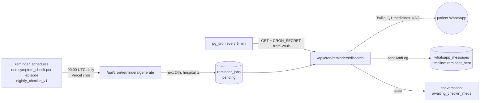
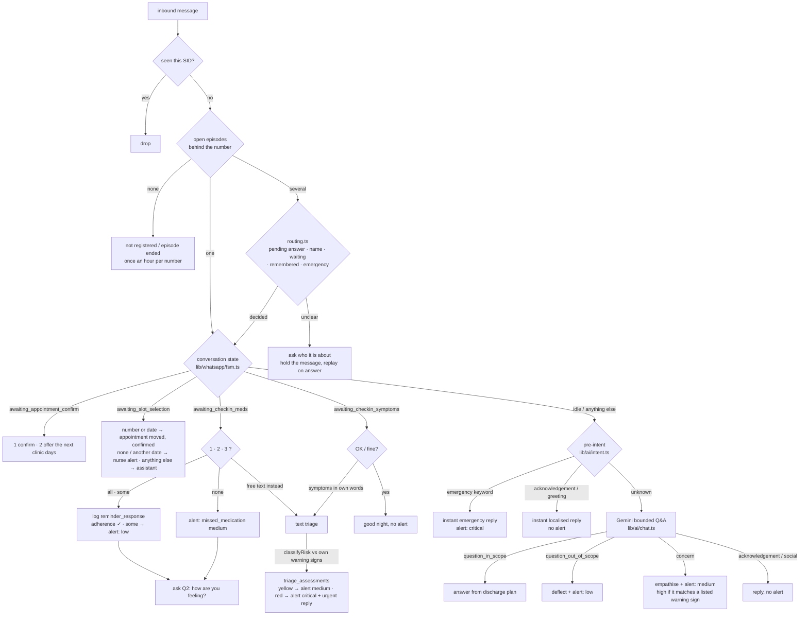

# CareLoop

Post-discharge patient follow-up over WhatsApp, for hospitals in the UAE.

Clinical staff use a web dashboard; patients never install anything. A nurse uploads the
discharge document, checks the details it was read into, and approves the summary; the patient
then receives their care plan on WhatsApp in their own language, gets one check-in every night
(medicines taken? how are you feeling?), can ask questions that are answered strictly from their
own discharge instructions, and is escalated to a nurse the moment they report a warning sign.

- **Product context:** [PROJECT_CONTEXT.md](./PROJECT_CONTEXT.md) (vision, systems, languages)
- **Design:** [ARCHITECTURE.md](./ARCHITECTURE.md) (schema, roles, workflows — the original proposal)
- **Agent notes:** [AGENTS.md](./AGENTS.md) (this is Next.js 16; read `node_modules/next/dist/docs/` before writing framework code)

---

## Contents

1. [Stack](#stack)
2. [How it works](#how-it-works)
3. [Repository layout](#repository-layout)
4. [Local development](#local-development)
5. [Database](#database)
6. [Background jobs](#background-jobs)
7. [Deployment](#deployment) — incl. [Demo: several people on WhatsApp at once](#demo-several-people-on-whatsapp-at-once)
8. [Operations runbook](#operations-runbook)
9. [Security model](#security-model)
10. [Testing](#testing)
11. [Known limitations](#known-limitations)

---

## Stack

| Layer | Technology |
|---|---|
| Dashboard | Next.js 16 (App Router, Turbopack), React 19, TypeScript, Tailwind 4, shadcn/ui, Recharts |
| Backend | Next.js route handlers on Vercel; Supabase (Postgres 17, Auth, Storage, Realtime, Vault) |
| Scheduling | Vercel Cron (daily jobs) + `pg_cron` / `pg_net` inside Supabase (5-minute dispatch) |
| Messaging | WhatsApp via **Twilio** (currently the sandbox; text only) |
| AI | Gemini 2.5 Flash (extraction, translation, patient Q&A, triage, voice-note transcription) through `lib/ai/gemini.ts`, which retries a 5xx on the primary once, moves on at once after a 429 (that model's quota is spent, and it rests at the back of the queue for a while), and falls back to `gemini-3.6-flash` → `gemini-3.1-flash-lite` → `gemini-3.1-pro-preview` (Google's successors to the 2.5 models, which new keys cannot use), one try each, then to **Groq** (`lib/ai/groq.ts`, `GROQ_API_KEY`) once Gemini has nothing left — a free tier running dry is not something more retries can fix, and every call here is text in, text out. Every call asks for the least thinking the model allows (off on 2.5 Flash, "minimal"/"low" on 3.x): reading a letter, translating, triage and short answers need no reasoning step, and it was most of the wait; OpenAI Whisper only as an optional transcription fallback |
| PDF | `unpdf` (serverless-safe text extraction) |

Multi-tenant: every row carries `hospital_id` and Postgres Row Level Security enforces isolation.
Roles: `super_admin`, `hospital_admin`, `discharge_coordinator`, `nurse`, `case_manager`, `read_only`.

---

## How it works

### 1. Discharge → care plan (nurse)

Intake is **document-first**: the nurse drops the discharge PDF and the form fills itself.

```
drop PDF   ──► /api/v1/intake/extract            (unpdf → Gemini: patient demographics + encounter + medications,
                                                   follow-ups, warning signs; nothing written yet)
nurse checks ► /episodes/new                      (pre-filled; nurse types the WhatsApp number — it is never in
                                                   the document — fills in anything the letter lacked, confirms)
           ──► /api/v1/intake/commit             (patient by MRN or new · episode · PDF → Storage
                                                   discharge-documents/<hospital>/<episode>/… · discharge_documents
                                                   · draft summary + medications + follow_up_requirements
                                                   └─ after(): translate into patient + hospital languages)
nurse reviews ► /episodes/[id]/review             (edit, notes, then one "Approve and send" after a confirmation —
                                                   nothing reaches the patient before this; once sent, the plan
                                                   is read on the patient page, not edited)
           ──► /api/v1/episodes/[id]/summary/send (WhatsApp care plan; episode → active; nightly check-in scheduled)
```

**Sample letters (demo).** Beside the drop box, Add patient shows three fictional discharge letters
as PDF files (Fatima Al Hashimi — heart failure; Umar Siddiqui — heart attack, stent; Farzana Arif —
gallbladder surgery). Drag one into the box (a click works too, for touch screens); there is no
entry by hand, every patient starts from a letter. `GET /api/v1/intake/sample-letters/[id]` prints it as a
PDF with **today** as the discharge day (`lib/intake/sample-letters.ts`, rendered by the dependency-free
`lib/pdf/text-pdf.ts`), and it is read like any upload. The same letters are in `docs/` with their
original dates. When the AI reader fails on one of them (no Gemini/Groq key, quota spent, Google busy)
the extract route answers with the letter's built-in reading instead (`read_by: "sample"`, noted on
the form), so a sample letter never stops at "Couldn't read that letter"; the AI gets 20 s on them
before that. Adding a sample patient again closes their open care plan first
(`lib/intake/sample-restart.ts`: episode completed, alerts resolved, pending check-ins and
unconfirmed appointments cancelled), so a letter can be demoed any number of times.

**The WhatsApp number (demo).** The number is typed on Add patient, checked as it is typed (it
must start with + and the country code; a UAE mobile typed the local way, `050…`, is offered back as
`+97150…`) and saved as typed; the server accepts E.164 only. **Use demo number** fills in
`siteConfig.demoWhatsAppNumber` (`+971505263427`, the team's test phone); patients sharing it are
told apart by the shared-number routing. Anyone can use their own phone instead: the card shows the
Twilio sandbox QR code (`lib/whatsapp/sandbox.ts`: it opens WhatsApp on +1 415 523 8886 with
`join claws-general` typed), and once that is sent the phone gets the care plan, the check-ins and
the answers. The same code is behind **Try it on your phone** in the sidebar. `null` hides the
demo-number button and the code.

`lib/intake/persist-extraction.ts` is the single place an extraction becomes a summary; the older
`/api/v1/episodes/[id]/documents` + `/extract` pair still works for re-uploading on an existing
episode.

Approval activates the episode, which creates its `whatsapp_conversations` row (DB trigger).

The care plan message (`buildDischargeSummaryMessage`, plain text on the sandbox) lists medicines,
key instructions, **follow-up appointments** (booked slots with time and place, or the letter's
"by" date marked "time to be confirmed") and the warning signs. Section headings are in the
patient's language. When that differs from the document's, the content goes out translated, and
only ever as a translation of the plan as the nurse approved it: each `discharge_summary_translations`
row records a hash of the text it was made from (`summarySourceHash` in `lib/ai/translation.ts`), a
save on the review page drops the rows that no longer match, and the send translates the current plan
when no row matches (up to 25 s; otherwise it goes out as written, under the patient's own headings).
Preview it without sending: `npx --yes tsx scripts/preview-care-plan.ts hi`.

**Did it arrive?** Every outbound message names the webhook as its Twilio `StatusCallback`, so the
row in `whatsapp_messages` moves `sent → delivered → read` (ticks on the Conversation tab) or becomes
`failed` with the reason in plain language in `metadata.error` (`lib/whatsapp/delivery.ts`).
"Accepted by Twilio" is not "reached the patient": WhatsApp only allows free-text messages within
**24 hours of the patient's last message** (Twilio error 63016), and the sandbox only reaches numbers
that have joined it (63015). A failed care plan raises a `delivery_failed` alert and a banner on the
episode page with **Resend now**; and the moment the patient sends *anything* to the hospital
number, `redeliverFailedCarePlan` sends the plan again on its own (`lib/whatsapp/care-plan.ts`).

### 2. Nightly check-in (automatic)

One scheduled conversation per patient per day, at **21:00 hospital-local** (override:
`hospitals.settings.checkin_time`). Per-dose medication reminders were retired in migration 00009;
dose times stay on the medications as instructions in the care plan.



- `lib/reminders/checkin.ts` builds the schedule row; `summary/send` inserts it when the plan goes out.
- `lib/reminders/generator.ts` converts the wall-clock time in the hospital's timezone to a UTC
  instant with `date-fns-tz` (`fromZonedTime`) — correct regardless of the server's timezone.
- `reminder_jobs (schedule_id, fire_at)` is unique, so re-running the generator is idempotent.
- `lib/reminders/dispatcher.ts` sends everything due (`status = pending AND fire_at <= now()`).
- Wording for all five languages lives in `lib/whatsapp/checkin-templates.ts`.

### 3. Inbound WhatsApp (patient)

Twilio POSTs to `/api/webhooks/whatsapp`. The route verifies the Twilio signature, returns `200`
immediately, and does the work inside Next's `after()` so Vercel keeps the function alive.



Escalation is **derived in code** from the classified intent (`deriveEscalation()`), never left to
the model's discretion: a thank-you cannot page a nurse, a symptom report always does.

Symptom reports are graded by `classifyRisk()` against the patient's own emergency symptoms and land
in `recordTriage()` (webhook handler): a `triage_assessments` row — DB triggers from 00003 then
raise the yellow/red alert (assigned to the nurse) and bump the episode's `current_risk_level` —
plus a localised reply telling the patient what to do and a `triage_completed` timeline event. If
the model is unavailable the report is still acknowledged and escalated at medium — a symptom
report is never dropped.

**Voice notes** (`takeVoiceNote()` in the webhook handler). The audio is downloaded from Twilio and
kept in the private `voice-notes` bucket (migration 00016, `<hospital>/<episode>/<SID>.<ext>`, the
path on `whatsapp_messages.media_storage_path`), so a nurse can press **Listen** on the Conversation
tab. Gemini transcribes it and rates how clearly it heard it, 0–100 (`transcribeVoiceNote()`; the
model's own estimate against a fixed scale, not a measured accuracy). The transcript becomes the
message's text, so the bubble and Translate work as for typed messages.

| The note | What happens |
|---|---|
| Heard clearly (clarity ≥ `VOICE_CLARITY_THRESHOLD`, 80) | Exactly as if typed: a question is answered, a check-in answer counts, a symptom is triaged, an emergency word escalates |
| Not clearly, but what was heard triages red | Acted on at once: urgent reply, critical alert, red — an emergency never waits for someone to press play |
| Not clearly (or nothing intelligible) | "Your care team will review it" to the patient; medium alert "Voice note unclear (45%) — listen to it"; patient yellow; the bubble says **Unclear · 45%** |
| While a nurse is chatting | Nothing is said over the nurse; only a red result is acted on |
| Audio could not be downloaded or transcribed | Acknowledged, and handed to a nurse at medium |

80 is a starting point — adjust it once real voice notes have been heard.

**The patient's colour** (`care_episodes.current_risk_level`, the Stable / Monitor / Critical badge)
is raised by every kind of report, never lowered by the system (`lib/episodes/risk.ts`):

| Report | Alert | Colour |
|---|---|---|
| Triage (voice note, check-in symptom answer): red / yellow / green | critical / medium / none | red / yellow / unchanged |
| Emergency word ("chest pain", "सीने में दर्द" …) — no model | critical | red |
| Symptom in chat matching one of the patient's warning signs / other symptom | high / medium | red / yellow |
| Symptom report the model could not assess, or a voice note not heard clearly | medium | yellow |

Red always wins; yellow only replaces green. Lowering it is a nurse's call: **Change** on the
episode's Risk level card (`POST /api/v1/episodes/[id]/risk`) needs a note when lowering, refuses
if a report raised the colour after the nurse looked (so a new red is never overwritten
unknowingly), and records the change on the timeline (`risk_changed`, migration 00015) and in
`audit_logs` with the nurse's name. The generic episode PATCH no longer accepts the colour.

Every outbound message — from any path — goes through `lib/whatsapp/outbound.ts` `sendAndLog()`,
which sends via Twilio and records the exact delivered text on the conversation. The episode page's
**Conversation** tab renders this transcript live.

**One number, several patients.** One hospital number serves every patient, and a patient's own
number is not unique either: a family shares a phone, a daughter writes for both parents, a tester
registers three demo patients on their own number. Every open episode behind the sender's number
is a candidate (`findOpenEpisodesByPhone()`), each patient keeps their own conversation, state and
transcript, and `lib/whatsapp/routing.ts` decides which one a message belongs to — first match wins:

| Rule | Example |
|---|---|
| One open episode behind the number | everything below is skipped — the usual case |
| A "who is this about?" question is pending | `2`, `Umar`, `it's for Farzana`, `2: can she eat rice?` |
| The message starts with a patient's name | `Umar: can I walk today?`, `for Farzana – she is dizzy` |
| `switch` | lists the patients again |
| The remembered patient is mid-dialogue | a check-in question is waiting on their conversation |
| Exactly one conversation is waiting for a reply | `1` answers that check-in |
| The patient written about in the last 24 h | a follow-up `thanks` |
| An emergency keyword | goes to the likeliest patient at once — never held |
| Otherwise | the assistant asks, holds the message, and replays it once answered |

The per-number memory (`whatsapp_number_sessions`, migration 00011) holds the remembered patient
and any pending question with the held message. The question is logged on every linked transcript;
inbound rows on a shared number carry `metadata.routing = { via, linked_patients }` and the
Conversation tab shows a "Shared number" notice plus how each message was matched. Intake warns
when a number is already on another open episode. Table-tested in `scripts/check-routing.ts` and
end to end in `scripts/check-webhook.ts` (in-memory Supabase, captured Twilio). Preview the wording
in any language without sending: `npx --yes tsx scripts/preview-shared-number.ts ar`.

Two more things the handler does for many senders on one number: a redelivered Twilio message
(retry, double-tap) is handled once — the UNIQUE `wa_message_id` insert is the claim — and messages
from the same sender are handled in order, one at a time, while different senders run side by side
(`lib/whatsapp/sender-queue.ts`). A number nobody is registered on hears "not registered" once an
hour, not once per message. Every inbound row also records who typed it (Twilio's `ProfileName`,
shown as "typed by …" when it is not the patient's own name), and a picture or document with no
caption is answered with "I cannot look at pictures yet" instead of being sent to the model.

**Delivery receipts.** Every send asks Twilio to report back to the webhook (`StatusCallback`, when
`NEXT_PUBLIC_APP_URL` is `https`). Transcript rows move sent → delivered → read (one tick, two, two
in blue) or to failed with the reason in plain language — 63016 "sent outside WhatsApp's 24-hour
window" is the one you will see most; a failed care plan is re-sent on its own when the patient next
writes (section 1). Nurses can also press **Forget** on the shared-number notice to reset who a
number is currently taken to be writing about.

**Nurse chat.** Clinical staff can write to the patient from that tab (`POST /api/v1/episodes/[id]/messages`).
The message is sent as the nurse (logged with `metadata.sender = 'nurse'`, shown in a solid bubble
with their name) and the conversation enters `nurse_attending` for 30 minutes: patient replies are
logged and streamed to the dashboard but the assistant does not answer over the nurse. Emergency
keywords still escalate instantly and a voice note that triages red is still acted on. "Hand back to assistant"
(`PATCH { attending: false }`) or the 30-minute expiry returns the conversation to `idle`; the
nightly check-in also takes over when it fires.

**One language for the patient, English for the nurse.** Everything the patient receives is in their
`preferred_language`: the fixed replies (emergency, "your care team will look at this", the
episode-ended notice …) exist in all five languages, the assistant is told to answer in that
language whatever language the patient writes in, and a nurse's message is translated before it
is sent (`translateNurseMessage`, Gemini). The patient gets the translation; the transcript shows it
with what the nurse typed underneath (`metadata.original_text`). If the translation fails, nothing
is sent and the nurse chooses **Send as typed** — the untranslated text never goes out on its own.
Unticking "Translate into …" under the message box sends exactly what was typed. For the nurse,
every message in the patient's language has its own **Translate** button, and **Show English** on
the Conversation tab puts an English translation under all of them
(`POST /api/v1/episodes/[id]/messages/translate`); each one is kept on its message
(`metadata.translation_en`), so it is translated once and reaches other open transcripts through
realtime. English is kept **per text, not per message** (`lib/ai/transcript-english.ts`): a
follow-up conversation is mostly repetition — one Tamil episode here holds 44 messages made of 8
distinct texts, the nightly check-in over and over — so the model is asked once per sentence, the
answer is written onto every copy, and a transcript whose texts are already known opens in English
with no model call at all. Short answers with no letters ("1", "👍") are never sent. The first
request goes alone because its answer carries the whole transcript; anything still missing follows
in small groups, newest first, so the messages on screen fill in first. A busy key no longer costs
the nurse the English the episode already has: the answer carries what is known and only the texts
that could not be read come back untranslated. The preference is remembered per browser. Translation calls skip Gemini's
thinking step (`generate(…, { noThinking: true })`, 2.5 Flash models only), which is most of a
model call's wait. Translations need `GEMINI_API_KEY` (or `GROQ_API_KEY` behind it); the fixed
replies do not.

### 4. Appointments

**From the letter, automatically.** Every dated follow-up in a discharge summary ("Cardiology
clinic by 3 Oct") becomes a provisional appointment the moment the document is read
(`lib/appointments/sync-follow-ups.ts`, called from `persistExtraction()` and from the review
PATCH): `time_tbc = true`, `scheduled_at` = the "by" date at 09:00 hospital-local, linked through
`appointments.follow_up_id`. The Appointments screen shows these as "Due by … · time to confirm"
with the letter's instructions; booking a real time (appointment PATCH) clears the flag. Follow-ups
without a timeframe are listed under "Needs a date" until the nurse adds a date on the review page
(before the care plan is sent) or books the visit with **Book** on the patient's Care plan tab (after).
Edits in review re-sync: untouched provisional rows move or disappear with their follow-up; anything
a nurse has booked, confirmed or cancelled is left alone.

`/api/v1/episodes/[id]/appointments/[appointmentId]/send-confirmation` asks the patient "Can you
attend?" and puts the conversation in `awaiting_appointment_confirm`. *1* confirms. *2* offers new
times (`lib/whatsapp/reschedule.ts`): the next three clinic days after the appointment, at the same
time of day, numbered, plus one number for "none of these" (`lib/appointments/slots.ts`). Clinic days
are Mon–Fri unless `hospitals.settings.clinic_days` says otherwise (ISO weekdays, e.g. `[1,2,3,4,5,6]`).
The offer is kept in `appointment_slots_cache` and the conversation waits in `awaiting_slot_selection`.
A number, or a typed date that matches one of the times ("6th October", "Wed", "7/10"), moves the
appointment there and confirms it. The patient gets the confirmation, and the Appointments screen,
the appointment page and the Timeline show the move live. "None of these" (or the last number), or
a date that is not on the list, goes to a nurse: the patient is told a nurse will contact them, an
`unconfirmed_appointment` alert is raised, and the date they asked for is on the Timeline and the
appointment page. Anything else they write meanwhile (a question, a symptom) is answered by the
assistant as usual, since it is what checks for warning signs, and the times stay on offer. Only a
message that is nothing but a date is read as one.

The daily `escalate` job raises an `unconfirmed_appointment` alert after 48h and marks past-due,
unconfirmed appointments as missed. The scheduling adapter is currently `manual`: the times offered
come from clinic days, not a live clinic calendar, and there is no hospital PAS integration yet.

### 5. Dashboard

| Route | Purpose |
|---|---|
| `/` | Overview: four headline numbers, **Needs attention** (open alerts, most urgent first, live; key reminders: care plans to review or send, acknowledged alerts to resolve, appointments in the next 3 days not confirmed; alerts per hour over the last 24 hours), tonight's check-ins and the next 7 days of appointments |
| `/patients` | One row per care plan (episode), red first; filters Active · Needs review · Draft · Completed · All; search; open-alert count per row. `/episodes` redirects here |
| `/episodes/[id]` | The patient page: header with risk (and **Change**), this patient's open alerts with Acknowledge / Resolve, an at-a-glance line, and three tabs — **Conversation** (with Show English / Translate, and **Reply as …** for demo patients), **Care plan**, **Activity** |
| `/episodes/new`, `/episodes/[id]/review` | **Add patient** (drop the discharge letter, or drag in a demo letter → the few details to check, the rest folded away) and **Review care plan** — medicines, warning signs, follow-ups, instructions — sent with one **Approve and send** after a confirmation |
| `/patients/[id]` | A patient's history — earlier care plans (linked from the patient page when there are any) |
| `/appointments` | Appointment status across the hospital; an appointment's own page books the time, asks the patient to confirm, or cancels |
| `/alerts` | Open / acknowledged / resolved alerts, realtime |
| `/analytics` | Patients, check-ins answered, appointments confirmed, open alerts — counted, nothing estimated — and four charts |
| `/settings` | Your account, the hospital, and how patients are messaged (check-in time, languages, shared numbers) |

Screens use the words a nurse uses: care plan (not episode), symptom check (not triage), nightly
check-in (not reminder), *Needs review*, *Needs a nurse*.

**Guided tour (for judges and first-time visitors).** The first visit opens a welcome (what
CareLoop is for, the three things the tour shows) and a two-minute tour that walks one patient
through the real app: the Overview → **Try it on your own phone** (the sandbox QR code and what to
do in WhatsApp, or the demo phone) → **Add patient** (a copy of Fatima's PDF flies from the demo
letter into the box until the visitor drags it in; on a phone it says tap) → the details read from
the letter → the WhatsApp number (Next waits for a whole one; **Do it for me** uses the demo
number) → **Review care plan** → **Approve and send** → the patient's **Conversation** → **Reply
as Fatima** (see below) → the alert it raises → Alerts, Analytics. Each step dims the page and lights
one element; what to click pulses, with a tapping pointer, and **Do it for me** does it. The tour
moves on when the visitor does what it asks (a click, the next page, a signal from the page), follows
them if they go ahead on their own, shows **Tour paused · Resume** if they wander off, survives a
reload, and carries on if WhatsApp refuses the care plan. The **Tour** button in the header starts it
again or resumes it. Esc ends it; the arrow keys page through the steps you only read.
`src/components/tour/` (steps in `tour-steps.tsx`, state in `tour-store.ts`, the spotlight in
`tour-layer.tsx`); pages report what the tour can't see through `lib/tour/signals.ts`
(`intake:reading`, `careplan:failed`, `patient:alerted`…). `npm run check:tour` fails when a step
points at an element no page marks with `data-tour`.

**Reply as the patient (demo patients only).** Under a demo patient's conversation, **Reply as
Fatima** lets someone without the patient's phone write as the patient: suggested messages in the
patient's language (one urgent symptom, two questions) or anything typed.
`POST /api/v1/episodes/[id]/simulate-reply` runs the text through `handleSimulatedPatientMessage`,
the same handling as a WhatsApp message from that phone (the routing on a shared number is skipped:
the patient is known), so the answer goes out on WhatsApp, triage and alerts happen for real, and
the transcript marks the message *Demo reply*. Only the sample letters' MRNs are accepted; a real
patient's words are never made up.

Realtime (`postgres_changes`) is enabled for `alerts`, `patient_timeline_events`, `whatsapp_messages` and `whatsapp_number_sessions`.

Theme: light / dark / system toggle in the header, persisted by `next-themes`.
All colours are semantic tokens in `src/app/globals.css` (`brand`, `teal`, `success|warning|danger|info` with
`-soft` and `-foreground` variants, `chart-1…5`, `sidebar-*`) — components never use raw hex or palette classes.

---

## Repository layout

```
src/
  app/
    setup                            shown only when the automatic admin sign-in is impossible (missing service key)
    (dashboard)/…                    pages above
    api/v1/…                         session-authenticated JSON API (patients, episodes, summaries, appointments, alerts, analytics)
    api/cron/…                       reminders/generate, reminders/dispatch, appointments/escalate  (CRON_SECRET bearer)
    api/webhooks/whatsapp            Twilio inbound webhook
  proxy.ts                           auth gate (Next 16 "proxy", formerly middleware) — see publicPaths
  lib/
    ai/        extraction.ts  translation.ts  chat.ts (Q&A + deriveEscalation)  intent.ts (pre-classifier)  triage.ts  guardrails.ts
    whatsapp/  client.ts (Twilio)  outbound.ts (sendAndLog)  fsm.ts  webhook-handler.ts  templates.ts
               recipient.ts (who is behind a number)  routing.ts (which patient a message is about)  shared-number.ts
               number-session.ts  inbound-log.ts (dedupe by SID)  sender-queue.ts (in-order per sender)  routing-templates.ts
               twilio-payload.ts (inbound form → ParsedInbound)  status-callback.ts (delivery receipts)  unknown-number.ts
    reminders/ generator.ts  dispatcher.ts
    intake/    persist-extraction.ts  validate.ts  sample-letters.ts (demo letters + their built-in reading)  sample-restart.ts
    pdf/       text-pdf.ts (small text-only PDF writer for the sample letters)
    supabase/  server.ts (user + service clients)  client.ts (browser)  middleware.ts (session refresh + public paths)
    auth/      session.ts  permissions.ts
  components/  alerts/  analytics/  appointments/  dashboard/ (key reminders, alerts by hour)  episodes/ (incl. Reply as the patient)  intake/ (demo letter panel)  tour/ (guided tour)
               patients/ (timeline, transcript, adherence)  ui/ (shadcn)
  config/      site.ts (name, demoWhatsAppNumber)
  types/       database.ts  enums.ts  api.ts
supabase/
  migrations/  00001 … 00016 (see Database)
  seed.sql     demo hospital, department, approved guidance
  demo_seed.sql evergreen demo dataset (7 patients incl. a shared family number; all dates relative to today)
scripts/
  check-intent.ts   table-driven checks for intent / escalation / FSM
  check-*.ts        the other suites behind `npm run check` (see Testing)
```

---

## Local development

```bash
git clone https://github.com/Mohammad-Umar7/CareLoop.git CareLoop
cd CareLoop
npm install
cp .env.example .env.local     # then fill it in — see below
npm run dev                    # http://localhost:3000
```

### Environment variables

Documented in [`.env.example`](./.env.example). Summary:

| Variable | Notes |
|---|---|
| `NEXT_PUBLIC_SUPABASE_URL`, `NEXT_PUBLIC_SUPABASE_ANON_KEY` | Public; inlined into the client bundle at build time |
| `SUPABASE_SERVICE_ROLE_KEY` | Server only — cron routes, webhook, extraction |
| `NEXT_PUBLIC_APP_URL` | Public base URL. **Twilio's webhook URL must be exactly `<this>/api/webhooks/whatsapp`** — the signature check reconstructs it |
| `CRON_SECRET` | Bearer token for `/api/cron/*`. Must match the Vault value used by pg_cron (see [Deployment](#deployment)) |
| `GEMINI_API_KEY` | Extraction, translation, Q&A, triage |
| `GROQ_API_KEY` | Optional. Asked when every Gemini model has refused — quota, overload or a name the key cannot use. Text calls only; voice notes stay with Gemini. `GROQ_MODELS` overrides the chain when Groq retires one |
| `OPENAI_API_KEY` | Optional. Whisper fallback if Gemini transcription fails; not set in production since 2026-09-19 |
| `TWILIO_ACCOUNT_SID`, `TWILIO_AUTH_TOKEN`, `TWILIO_WHATSAPP_NUMBER` | Sandbox sender is `whatsapp:+14155238886` |
| `WHATSAPP_USE_TEXT_FALLBACK` | `true` on the sandbox: interactive buttons are rendered as numbered text options |

The dashboard works with only the Supabase variables; AI and Twilio keys are needed when you
upload a PDF, send messages, or transcribe voice notes.

### Pointing the local app at a database

Local dev usually points at the shared Supabase project (there is no local Supabase stack in use).
Be aware that cron routes hit from `localhost` operate on that database.

### Receiving WhatsApp locally

Twilio can only call a public URL. Either test inbound against the deployed app (the default), or
expose your dev server with a tunnel and temporarily set both `NEXT_PUBLIC_APP_URL` and the Twilio
sandbox webhook to the tunnel URL. In development the signature check logs a warning instead of
rejecting.

Cron routes can be triggered by hand:

```bash
curl -H "Authorization: Bearer $CRON_SECRET" http://localhost:3000/api/cron/reminders/generate
curl -H "Authorization: Bearer $CRON_SECRET" http://localhost:3000/api/cron/reminders/dispatch
curl -H "Authorization: Bearer $CRON_SECRET" http://localhost:3000/api/cron/appointments/escalate
```

---

## Database

### Migrations (`supabase/migrations/`)

| # | Name | What it does |
|---|---|---|
| 00001 | `initial_schema` | Enums, 26 tables, indexes, `updated_at` triggers |
| 00002 | `rls_policies` | RLS on every table; helper functions `get_my_hospital_id()`, `is_clinical()` … |
| 00003 | `functions_triggers` | Conversation-on-activation, triage → risk level → alert → timeline, `compute_compliance_snapshot()` |
| 00004 | `storage_and_realtime` | Private `discharge-documents` bucket (PDF, 20 MB) with **hospital-scoped** object policies; realtime for `alerts`, `patient_timeline_events` |
| 00005 | `harden_functions` | Revoke `anon`/`authenticated` EXECUTE on SECURITY DEFINER functions (helpers stay callable by `authenticated`); fixed `search_path` |
| 00006 | `reminder_jobs_unique` | Unique `(schedule_id, fire_at)` — required by the generator's `ON CONFLICT` |
| 00007 | `pg_cron_dispatch` | `pg_cron` + `pg_net`; `configure_cron_dispatch(url, secret)` (service_role only) writes Vault; job `dispatch-reminders-every-5-min` |
| 00008 | `realtime_whatsapp_messages` | Realtime for the conversation transcript |
| 00009 | `nightly_checkin` | `alert_type += missed_medication`; retires per-dose `medication` schedules (+ cancels their pending jobs); one `symptom_check` / `nightly_checkin_v1` schedule at the hospital's check-in time per active episode |
| 00010 | `follow_up_appointments` | `appointments.time_tbc`; backfills provisional appointments for dated follow-ups on open episodes and links existing appointments to their follow-up |
| 00011 | `whatsapp_number_sessions` | Per (hospital, sender number): the patient a shared number is currently writing about and any pending "who is this about?" question with its held message; hospital-scoped SELECT |
| 00012 | `realtime_number_sessions` | Realtime for the shared-number notice on the Conversation tab |
| 00013 | `delivery_failed_alert` | `alert_type += delivery_failed` for undelivered WhatsApp messages (the code falls back to `escalation` until applied) |
| 00014 | `revoke_rls_auto_enable` | Supabase's `rls_auto_enable()` event-trigger function is no longer callable by `anon` / `authenticated` over the API (security advisor 0028/0029); the `ensure_rls` event trigger is unaffected |
| 00015 | `risk_changed_event` | `timeline_event_type += risk_changed`: a nurse's change of the patient's colour on the timeline (until applied, the change is made and audit-logged, without the timeline entry) |
| 00016 | `voice_notes_bucket` | Private `voice-notes` bucket (audio, 16 MB) with a hospital-scoped read policy, so nurses can play patients' voice notes (until applied, notes are still transcribed and handled; the audio is not kept) |

Applying to a project:

```bash
supabase link --project-ref <ref>
supabase db push                     # applies any migration not yet in supabase_migrations.schema_migrations
```

The production project's history is recorded with these exact versions (`00001`–`00008`), so
`db push` is safe there. Migrations applied through other tools should be re-keyed to the file's
version in `supabase_migrations.schema_migrations` to keep this true.

### Seeds

- `seed.sql` — the demo hospital (`Dubai General Hospital`, id `00000000-…-0001`), a department, and
  two hospital-approved guidance entries. Idempotent.
- `demo_seed.sql` — seven demo patients with summaries, medications, appointments, alerts, triage,
  reminders, timeline and 14 days of compliance data, including the Rahman family (mother and son on
  one household number, with the who-is-this-about exchange on both transcripts). **All dates are
  relative to `now()`**, so the demo is always current. Idempotent for keyed rows (`ON CONFLICT DO NOTHING`).

To refresh the demo dataset (e.g. before a demo):

```sql
delete from patients where id in (
  '10000000-0000-0000-0000-000000000001','10000000-0000-0000-0000-000000000002',
  '10000000-0000-0000-0000-000000000003','10000000-0000-0000-0000-000000000004',
  '10000000-0000-0000-0000-000000000005');   -- cascades through every dependent table
-- then run the full contents of supabase/demo_seed.sql
```

Staff logins are not seeded: create the auth user in Supabase → Authentication, then insert a
`profiles` row with the same id, a `hospital_id` and a role. (There is no invite flow yet.)

### Key tables

`hospitals` · `profiles` (extends `auth.users`) · `patients` · `care_episodes` (one active per
patient) · `discharge_documents` · `discharge_summaries` (+ `_translations`, `medications`,
`follow_up_requirements`) · `appointments` · `reminder_schedules` → `reminder_jobs` ·
`whatsapp_conversations` (FSM state) → `whatsapp_messages` · `triage_assessments` · `alerts` ·
`ai_interactions` · `patient_timeline_events` · `compliance_snapshots` · `analytics_daily` ·
`hospital_approved_guidance` · `audit_logs`.

`hospitals.whatsapp_phone_number_id` must equal the Twilio sender number in E.164 **without** the
`whatsapp:` prefix (e.g. `+14155238886`); the webhook uses it to resolve the hospital from Twilio's `To`.

---

## Background jobs

| Job | Where | Schedule | Route |
|---|---|---|---|
| Generate next-day check-in jobs | Vercel Cron | `0 0 * * *` (00:00 UTC / 04:00 Dubai) | `/api/cron/reminders/generate` |
| Dispatch due check-ins | **pg_cron** (`dispatch-reminders-every-5-min`) | `*/5 * * * *` | `/api/cron/reminders/dispatch` |
| Escalate unconfirmed / mark missed appointments | Vercel Cron | `0 8 * * *` (08:00 UTC) | `/api/cron/appointments/escalate` |

Why the split: Vercel's Hobby plan only allows once-a-day crons, which delivered evening reminders
the next morning. `pg_cron` calls the dispatch route from inside the database every five minutes with
`pg_net`, reading the app URL and `CRON_SECRET` from **Supabase Vault** (`cron_base_url`,
`cron_secret`). The dispatcher does not atomically claim jobs, so exactly one scheduler must run it —
keep the Vercel dispatch cron removed.

All three routes accept `GET` (what Vercel and pg_net send) and `POST` (for manual triggering), are
listed as public in the auth proxy, and validate `Authorization: Bearer <CRON_SECRET>`.

---

## Deployment

**Vercel** deploys `main` automatically. Project env vars = the table above (Production + Preview).
`NEXT_PUBLIC_*` values are baked in at build time — after changing them, redeploy **without** the
build cache.

**Supabase** — one project per environment. New project checklist:

1. `supabase db push` (migrations 00001–00016), then `seed.sql` and, if wanted, `demo_seed.sql`.
2. Create staff auth users + `profiles` rows.
3. Set the hospital's `whatsapp_phone_number_id`.
4. Configure pg_cron dispatch (service role, via SQL editor or REST `rpc/configure_cron_dispatch`):
   ```sql
   select configure_cron_dispatch('https://<app-host>', '<CRON_SECRET>');
   ```
   Until both Vault entries exist the job runs but makes no HTTP call.

**Twilio** — Messaging → Try it out → Send a WhatsApp message → Sandbox settings →
"When a message comes in": `https://<app-host>/api/webhooks/whatsapp`, POST. Patients (and testers)
must join the sandbox from their phone (`join <keyword>` to +1 415 523 8886); a sandbox join
**lasts three days**, then the phone has to send the join message again.

### Demo: several people on WhatsApp at once

Any number of phones can write to the one sandbox number at the same time; each is matched to its
own patient record by its number, and each patient's Conversation tab updates live. Per person:

1. **Join the sandbox.** The join message (`join <two-words>`) and a QR code are on Twilio Console →
   Messaging → Try it out → Send a WhatsApp message. Each person sends it from their own WhatsApp
   to +1 415 523 8886 and gets Twilio's confirmation. Nobody has to be added in the console — the
   sandbox's participant list fills itself. **If the Twilio account is still a free trial**, the
   number must also be added under Phone Numbers → Manage → Verified Caller IDs (trial accounts can
   only message verified numbers, WhatsApp included); an upgraded account skips this.
2. **Register them as a patient** within 24 hours of that join message: `/episodes/new` → drag a
   demo letter into the box (or drop any discharge PDF) → check the details → **Save and check the care plan**
   → **Approve and send**. Type *their* number in international format (+971…, +91…), with a
   different MRN per patient (or **Use demo number** for the team's test phone).
   WhatsApp only allows free text within 24 hours of the person's last message; a care plan sent
   later fails with 63016, the episode shows "Care plan not delivered", and it goes out again by
   itself the moment they write anything.
3. **Chat.** "hi", "can I take paracetamol after lunch?", a voice note, "I have chest pain"
   (instant emergency reply + critical alert on `/alerts`). Replies arrive on the phone and the
   exchange appears on the episode's Conversation tab as it happens.

**One phone, two patients** (a family phone — and every demo patient while the demo number is
fixed): register two patients on the *same* number from two different sample letters, send both
care plans, then write "hi" — the assistant answers for the patient whose care plan went out last
(for a day), and once that is not clear it asks "Who is this
message about? 1. … 2. …", holds the message, and answers it for whoever the sender picks.
`Umar: can I walk today?` goes straight to Umar; `switch` lists the patients again. Both episodes
show the question, a "Shared number" notice with a **Forget** button, and under each message how
it was matched.

Sandbox limits to expect during a demo: it sends **one message every three seconds**, so with
several people writing at once replies can arrive a few seconds apart (or fail with 63018, which
the transcript explains); joins expire after three days; free text only inside the 24-hour window.
A free-trial Twilio account additionally includes 100 WhatsApp messages and expires 30 days after
sign-up. Demo patients seeded with made-up numbers (`demo_seed.sql`) cannot receive anything —
their nightly check-ins come back "not delivered" and raise an alert each night.

### Rotating `CRON_SECRET`

1. Generate: `python -c "import secrets; print(secrets.token_hex(32))"`
2. Vercel → Environment Variables → `CRON_SECRET` → edit (Production + Preview).
3. Supabase SQL editor: `select configure_cron_dispatch('https://<app-host>', '<new secret>');`
4. Redeploy on Vercel (the function reads env at deploy time).

---

## Operations runbook

**Is dispatch running?** (SQL editor)
```sql
select start_time, status, return_message from cron.job_run_details order by start_time desc limit 10;   -- '1 row' = HTTP call made
select created, status_code, left(content, 80) from net._http_response order by created desc limit 10;   -- expect 200 {"ok":true,...}
```
Vercel → Logs, filtered to `/api/cron/`, shows the route side (`sent=… failed=…`).

**A patient's reply wasn't handled** — check in order: Twilio Console → Monitor → Messaging (was the
webhook called, what did it return?), Vercel logs for `/api/webhooks/whatsapp` (`Invalid signature`
means the URL in Twilio ≠ `NEXT_PUBLIC_APP_URL`; every handled message logs one
`[WhatsApp] SM… from …1234 type=text linked=2 deliver → <patient> (reply)` line with the routing
decision, and `duplicate delivery ignored` means Twilio retried), then the episode's Conversation and
Timeline tabs.

**A message went to the wrong patient on a shared number** — the transcript label under the bubble
says why (reply to the pending question, last patient written about, best guess…). Press **Forget**
on the shared-number notice so the next message is routed from scratch, and tell the family to start
messages with the name (`Umar: …`). A best-guess delivery also raised a low alert on that episode.

**The family keeps getting "Who is this message about?"** — both patients had a question open at the
same time. The dispatcher staggers nightly check-ins on a shared number so this should be rare; a
name at the start of the reply answers it for good, and `switch` lists the patients again.

**A message shows "Not delivered"** — the reason is on the bubble (Conversation tab) and on the
timeline. 63016: sent more than 24 hours after the patient's last message (WhatsApp's window) — the
patient sends any message and the care plan goes out again automatically; other messages the nurse
resends by hand. 63015: the number has not joined the Twilio sandbox (`join <keyword>`; sandbox
sessions lapse after 72 hours). No receipt at all: `NEXT_PUBLIC_APP_URL` must be the public https
URL, or Twilio has nowhere to post the status. Demo patients have fake numbers, so their messages
are *expected* to fail while Twilio is configured.

**Supabase project paused** (free tier pauses after a week idle) — Dashboard → Resume. The 5-minute
pg_cron job normally keeps it active.

**Security advisor** — Supabase → Advisors → Security. Expected residual warnings: the six RLS helper
functions callable by `authenticated` (required — policies evaluate them as the caller) and the
"leaked password protection" toggle.

---

## Security model

- **RLS everywhere.** Policies are hospital-scoped via `get_my_hospital_id()`; nurses see only
  assigned patients, coordinators and above see the whole hospital. The service role (server-side
  only) bypasses RLS for cron, webhook and extraction work.
- **Functions.** SECURITY DEFINER functions are executable only by `service_role`, except the RLS
  helpers, which `authenticated` needs. `anon` can execute nothing. Fixed `search_path` on all.
- **Storage.** `discharge-documents` is private; object paths are `<hospital_id>/<episode_id>/<file>`
  and policies match the first path segment to the caller's hospital.
- **No login screen (demo).** The auth proxy (`src/proxy.ts`) signs every visitor without a
  session in as the hospital's first active admin (`lib/supabase/demo-sign-in.ts`: a one-time
  magic-link token made with the service key, redeemed on the spot, no email sent), so opening the
  app lands straight on the dashboard; `/login` redirects there and there is no "Sign out". If the
  sign-in is impossible (no `SUPABASE_SERVICE_ROLE_KEY`, no active `hospital_admin` profile) the
  visitor gets `/setup`, which says which. Anyone with the link can see every patient and do
  everything that admin can, including messaging patients. Public without a session: `/setup`,
  `/invite`, `/api/webhooks` (Twilio signature), `/api/cron` (`CRON_SECRET`), `/api/v1/auth`.
- **Twilio** requests are HMAC-verified against the exact webhook URL.
- **Secrets** live in Vercel env vars and Supabase Vault; `.env*` is gitignored except `.env.example`.
- **AI guardrails.** The patient assistant answers only from the patient's own approved summary and
  hospital-approved guidance; it never diagnoses or changes medication. Emergency keywords bypass the
  model entirely. Arabic is matched by patterns (`ARABIC_EMERGENCY_PATTERNS` in `lib/ai/guardrails.ts`)
  rather than a phrase list: spelling variants folded, "my/his/her chest", Gulf, Egyptian and Levantine
  wording, and a negation ("صدري ما يعورني", my chest does not hurt) or a treatment's name ("بخاخ ضيق
  التنفس", the inhaler) is not an emergency. In English, a negation right before the words is not a
  report either ("no chest pain", "I don't have any chest pain", "I'm not short of breath";
  `ENGLISH_NOT_A_REPORT_BEFORE`). It is kept narrow, so "No I have chest pain", "no, chest pain",
  "I've never had chest pain like this", "without chest pain" and "not much chest pain" still alert.
  Hindi, Tamil and Tagalog keywords alert even when negated: in Hindi and Tamil the negation comes after
  the phrase and can belong to another verb ("सीने में दर्द नहीं रुक रहा", the chest pain won't stop).

---

## Testing

```bash
npm run lint           # eslint — clean; CI runs it with --max-warnings=0
npx tsc --noEmit       # typecheck
npm run build          # production build (needs NEXT_PUBLIC_SUPABASE_* set; placeholders are fine)
npm run check          # all eleven below
npm run check:intent   # table-driven checks: pre-intent classifier (incl. 139 Arabic phrasings: 102 that must fire, 37 that must not), escalation derivation, FSM (check-in, nurse chat, media), state parsing
npm run check:routing  # shared-number routing: name prefixes, answers to "who is this about?", the decision order, expiries
npm run check:webhook  # the inbound handler end to end against an in-memory Supabase and a captured Twilio (no keys, no network)
npm run check:gemini   # checks on the Gemini wrapper: retry on 503/network, next model on 429/404, "usage limit" vs "busy", 403 fails fast, budget respected
npm run check:delivery # Twilio status callbacks: sent → delivered → read ordering, failure reasons, one alert per message
npm run check:translation # nurse message → patient's language, transcript → English: unwrapping, JSON parsing, batching, partial failure; the care plan only ever as a translation of the plan as edited (stale translations dropped and never sent, translated at send, English if the model fails or is slow)
npm run check:reschedule  # "2 — change the date": clinic days, the times offered, numbers and dates in five languages, the messages
npm run check:analytics   # what the dashboard counts: check-in answers ("none taken" included), the 30-day trend, booked vs to-book appointments
npm run check:sample-letters # the sample letters print to PDFs that read back, are recognised with their printed dates (docs/ copies too), pass the commit schema; adding one again closes the old care plan
npm run check:model-json     # an AI reply that is nearly JSON still parses: a comma before } or ], a comment, a line break in a string; strings are never changed; anything else is still an error
npm run check:tour           # the guided tour: steps and the steps they open exist, every element it lights up carries its data-tour marker, Resume opens each step's page; each language's urgent demo reply raises an emergency
```

`scripts/lib/fake-supabase.ts` is the in-memory stand-in the webhook check runs on: enough of the
query builder (select / insert / upsert / update, embeds, UNIQUE → 23505) to exercise the real
handler. There is no browser end-to-end suite. The reference manual test is: create a patient with
a real sandbox-joined number → move their `reminder_schedules` row a few minutes ahead → trigger
`generate` → wait for the 5-minute tick → reply "1" then "OK" → confirm `reminder_response` on the
timeline and all four messages in the Conversation tab; then reply with a symptom in idle state and
check the alert. For the shared-number flow, register a second patient on the same number first.

---

## Known limitations

- **Twilio sandbox**, not a WhatsApp Business number: text only, per-number opt-in, 72-hour expiry.
- **WhatsApp's 24-hour window** applies to every business-initiated message (care plan, nightly
  check-in, appointment requests): outside it only approved templates are delivered, and the sandbox
  has none of ours. Today the failure is reported and the care plan self-heals when the patient
  writes; a production number needs Meta-approved templates for these openers.
- **Shared numbers**: the who-is-this-about question is answered by number or name; a held message is
  dropped if nobody answers within an hour (an emergency keyword or a voice note is never held). The
  per-sender ordering and the unknown-number cooldown live in process memory — one `next dev` or one
  warm Vercel instance — so across instances they rely on Twilio delivering in order.
- Delivery receipts need a public `https` app URL; on a localhost tunnel they do not arrive.
- **Free tiers**: Supabase (auto-pause) and Vercel Hobby (daily crons; dispatch runs from pg_cron instead).
- **Scheduling adapter is `manual`** — reschedule slots are not pulled from a hospital system.
- **No staff invite/onboarding flow** (`/invite` is reserved in the proxy but not built).
- `compute_compliance_snapshot()` exists but is not yet scheduled; adherence figures come from
  `reminder_response` events directly.
- Voice notes are checked end to end against a stubbed Twilio and model (`npm run check:webhook`),
  not yet against a live Twilio media URL. The clarity score is the model's own estimate; the 80
  threshold is a first guess to tune on real notes.
- Every reply to a registered patient is in their language. Only "not registered" is English: it
  goes to an unknown number, whose language nobody knows. Translations of nurse messages and of the
  transcript are machine translations (Gemini) — the transcript labels them, and the nurse's
  original is always kept beside what was sent.
